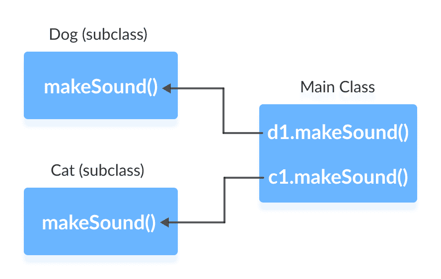
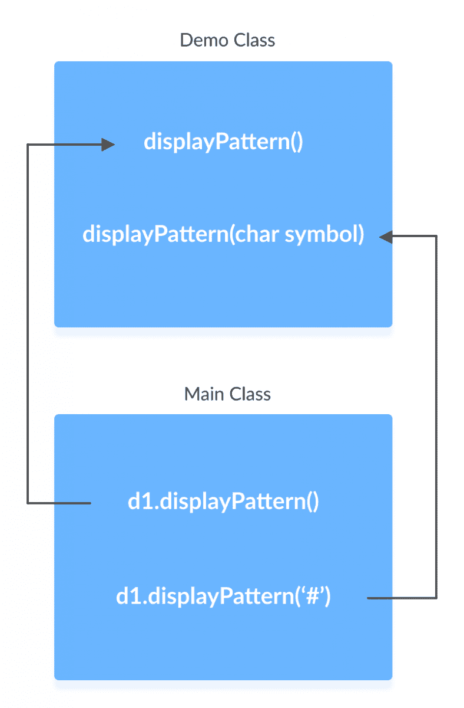

# Java 多态性

> 原文： [https://www.programiz.com/java-programming/polymorphism](https://www.programiz.com/java-programming/polymorphism)

#### 在本教程中，我们将通过示例学习多态性，不同类型的多态性以及如何在 Java 中实现它们。

多态是面向对象编程的重要概念。 它只是意味着不止一种形式。 也就是说，同一实体（方法，运算符或对象）在不同情况下的行为会有所不同。 例如，

Java 中的`+`运算符用于执行两个特定功能。 与数字（整数和浮点数）一起使用时，将执行加法运算。

```java
int a = 5;
int b = 6;
int sum = a + b;     //  Output = 11 
```

当我们对字符串使用`+`运算符时，它将执行字符串连接。 例如，

```java
String firstName = "abc ";
String lastName = "xyz";
name = firstName + lastName;     //  Output = abc xyz 
```

* * *

## 多态性的类型

在 Java 中，多态可以分为两种类型：

*   运行时多态
*   编译时多态

## 运行时多态

在 Java 中，可以通过方法重写来实现运行时多态。

假设在父类及其子类中创建了相同的方法。 在这种情况下，将要调用的方法取决于用于调用该方法的对象。 例如，

### 示例 1：方法覆盖

```java
abstract class Animal {
   public abstract void makeSound();
}

class Dog extends Animal {
   @Override
   public void makeSound() {
      System.out.println("Bark bark..");
   }
}

class Cat extends Animal {
   @Override
   public void makeSound() {
      System.out.println("Meow meow..");
   }
}

class Main {
   public static void main(String[] args) {
     Dog  d1 = new Dog();
      d1.makeSound();

      Cat c1 = new Cat();
      c1.makeSound();
   }
} 
```

**输出**：

```java
Bark bark…
Meow-meow... 
```

要了解方法覆盖的工作原理，请访问 Java 中的[方法覆盖。](/java-programming/method-overriding)

在上面的示例中，方法`makeSound()`在两个不同的类中具有不同的实现。 当我们运行程序时，

*   表达式`d1.makeSound()`将调用`Dog`类的方法。 这是因为`d1`是`Dog`类的对象。
*   表达式`c1.makeSound()`将调用`Cat`类的方法。 这是因为`c1`是 cat 类的对象。



在程序执行期间确定将要调用的方法。 因此，方法覆盖是运行时多态。

* * *

## 编译时多态

可以通过 Java 中的方法重载和运算符重载来实现编译时多态。

* * *

## 方法重载

在 Java 类中，如果参数不同，则可以创建具有相同名称的方法。 例如，

```java
void func() { ... }
void func(int a) { ... }
float func(double a) { ... }
float func(int a, float b) { ... } 
```

这在 Java 中称为方法重载。

让我们以方法重载为例。

### 示例 3：方法重载

```java
class Demo {
 public void displayPattern(){
   for(int i = 0; i < 10; i++) {
     System.out.print("*");
   }
 }

 public void displayPattern(char symbol) {
   for(int i = 0; i < 10; i++) {
     System.out.print(symbol);
   }
 }
}

class Main {
 public static void main(String[] args) {
   Demo d1 = new Demo();
   d1.displayPattern();
   System.out.println("\n");
   d1.displayPattern('#');
 }
} 
```

**Output**:

```java
**********
########## 
```

在上述程序中，`displayPattern()`方法已重载。

*   如果我们在不传递任何参数的情况下调用该方法，则会创建`*`模式。
*   如果我们通过传递一个字符作为参数来调用该方法，则会创建该字符的模式。



要了解有关方法重载的更多信息，请访问[方法重载](/java-programming/method-overloading)

* * *

### Java 方法重载与方法重载

*   在方法重载的情况下，方法应位于不同的类内。 而在方法重载的情况下，方法应位于同一类内。
*   方法重载在运行时执行，而方法重载在编译时执行。

* * *

## 运算符重载

Java 中的某些运算符对不同的操作数的行为会有所不同。 例如，

*   `+`运算符被重载以执行数字加法以及字符串连接，并且
*   `&`，`|`和`!`之类的运算符对于逻辑和按位运算都是重载的。

让我们看看 Java 中操作符是如何重载的。

Java 中的`+`运算符用于执行两个特定功能。 与数字（整数和浮点数）一起使用时，将执行加法运算。 例如，

```java
int a = 5;
int b = 6;
int sum = a + b;     //  Output = 11 
```

And when we use `+` operator with strings, it performs string concatenation. For example,

```java
String firstName = "abc ";
String lastName = "xyz";
name = firstName + lastName;     //  Output = abc xyz 
```

在像 C ++这样的语言中，我们可以定义运算符以对不同的操作数进行不同的处理。 但是，Java 不支持用户定义的运算符重载。

* * *

### 为什么要多态？

多态允许我们创建一致的代码。 例如，

假设我们需要绘制一个圆和一个正方形。 为此，我们可以创建`多边形`类，并从中继承两个子类`圆`和`正方形`。 在这种情况下，有意义的是在这两个子类中创建具有相同名称`render()`的方法，而不是创建具有不同名称的方法。

在我们的方法重载示例中，我们使用相同的方法名称`displayPattern()`来显示两种不同的模式以保持一致性。

Java 中的`print()`方法也是多态（方法重载）的示例。 相同的方法用于打印不同类型的值，例如`char`，`int`和`String`等。我们也可以使用相同的方法一次打印多个值。

* * *

## 多态变量

在 Java 中，对象变量（实例变量）表示多态变量的行为。 这是因为类的对象变量可以引用其类的对象及其子类的对象。 例如，

```java
class Animal {
   public void displayInfo() {
      System.out.println("I am an animal.");
   }
}

class Dog extends Animal {
   @Override
   public void displayInfo() {
      System.out.println("I am a dog.");
   }
}

class Main {
   public static void main(String[] args) {

     // declaration of object variable a1 of the Animal class
      Animal a1;

    // object creation of the Animal class
      a1 = new Animal();
      a1.displayInfo();
    // object creation of the dog class
      a1 = new Dog();
      a1.displayInfo();
   }
} 
```

**Output**:

```java
I am an animal.
I am a dog. 
```

在上面的示例中，我们创建了`Animal`类的对象变量`a1`。 在此，`a1`是多态变量。

这是因为，

*   在`a1 = new Animal()`语句中，`a1`是指`动物`类的对象。
*   在`a1 = new Dog()`语句中，`a1`是指`Dog`类的对象。

这是 Java 中的上播示例。 要了解更多信息，请访问 [Java 向上转换和向下转换](/java-programming/instanceof#upcasting-downcasting)。