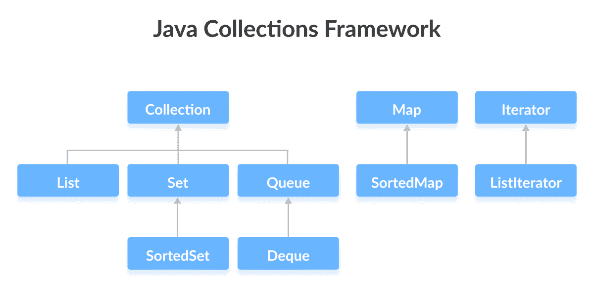

# Java 集合框架

> 原文： [https://www.programiz.com/java-programming/collections](https://www.programiz.com/java-programming/collections)

#### 在本教程中，我们将学习 Java 集合框架的不同接口。

Java **集合**框架提供了一组接口和类，以实现各种数据结构和算法。

例如，集合框架的`LinkedList`类提供了双向链接列表数据结构的实现。

* * *

## 集合框架的接口

Java 集合框架提供了各种接口。 这些接口包括几种对集合执行不同操作的方法。



在后面的章节中，我们将在各种类中详细了解这些接口，它们的子接口以及实现。 让我们在本教程中简要了解常用接口。

* * *

## Java `Collection`接口

`Collection`接口是集合框架层次结构的根接口。

Java 不提供`Collection`接口的直接实现，但提供其`List`，`Set`和`Queue`子接口的实现。 要了解更多信息，请访问： [Java `Collection`接口](/java-programming/collection-interface "Java Collection Interface")

### 集合框架与 采集界面

人们经常对集合框架和`Collection`接口感到困惑。

`Collection`接口是集合框架的根接口。 该框架还包括其他接口：`Map`和`Iterator`。 这些接口也可以具有子接口。

* * *

## `Collection`接口的子接口

如前所述，`Collection`接口包括由 Java 类实现的子接口。

`Collection`接口的所有方法也都存在于其子接口中。

这是`Collection`接口的子接口：

### `List`接口

`List`接口是一个有序的集合，允许我们添加和删除元素（如数组）。 要了解更多信息，请访问 [Java `List`接口](/java-programming/list "Java List Interface")

### `Set`接口

`Set`接口允许我们将元素存储在不同的集合中，类似于数学中的集合。 它不能有重复的元素。 要了解更多信息，请访问 [Java `Set`接口](/java-programming/set "Java Set Interface")

### `Queue`接口

当我们要以**先进先出**的方式存储和访问元素时，将使用`Queue`接口。 要了解更多信息，请访问 [Java `Queue`接口](/java-programming/queue "Java Queue Interface")

* * *

## Java `Map`接口

在 Java 中，`Map`接口允许将元素存储在**键/值**对中。 键是唯一的名称，可用于访问映射中的特定元素。 并且，每个键都有一个与其关联的值。 要了解更多信息，请访问 [Java Map Interface](/java-programming/map "Java Map Interface")

* * *

## Java `Iterator`接口

在 Java 中，`Iterator`接口提供可用于访问集合元素的方法。 要了解更多信息，请访问 [Java `Iterator`接口](/java-programming/iterator "Java Interface Interface")

* * *

## 为什么选择馆藏框架？

Java 集合框架提供了可以直接使用的各种数据结构和算法。 这有两个主要优点：

*   我们不必编写代码即可手动实现这些数据结构和算法。
*   随着集合框架的高度优化，我们的代码将更加高效。

此外，集合框架允许我们对特定类型的数据使用特定的数据结构。 这里有一些例子，

*   如果我们希望数据唯一，则可以使用集合框架提供的`Set`接口。
*   要以**键/值**对的形式存储数据，我们可以使用`Map`接口。
*   `ArrayList`类提供可调整大小的数组的功能。

* * *

* * *

## 示例：集合的`ArrayList`类

在总结本教程之前，让我们以集合框架的[`ArrayList`类](/java-programming/arraylist "Java ArrayList")为例。

`ArrayList`类允许我们创建可调整大小的数组。 该类实现`List`接口（它是`Collection`接口的子接口）。

```java
// The Collections framework is defined in the java.util package
import java.util.ArrayList;

class Main {
    public static void main(String[] args){
        ArrayList<String> animals = new ArrayList<>();
        // Add elements
        animals.add("Dog");
        animals.add("Cat");
        animals.add("Horse");

        System.out.println("ArrayList: " + animals);
    }
}

```

**输出**：

```java
ArrayList: [Dog, Cat, Horse] 
```

在后面的教程中，我们将借助示例来详细了解集合框架（其接口和类）。