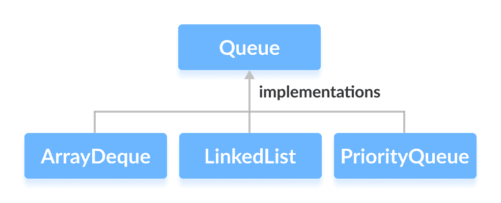
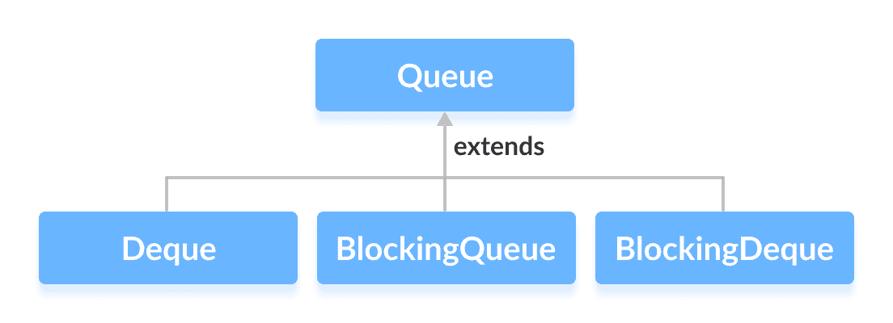

# Java `Queue`接口

> 原文： [https://www.programiz.com/java-programming/queue](https://www.programiz.com/java-programming/queue)

#### 在本教程中，我们将学习 Java `Queue`接口及其方法。

Java 集合框架的`Queue`接口提供队列数据结构的功能。 它扩展了`Collection`接口。

* * *

## 实现`Queue`的类

由于`Queue`是一个接口，我们无法提供它的直接实现。

为了使用`Queue`的功能，我们需要使用实现它的类：

*   [ArrayDeque](/java-programming/arraydeque "Java ArrayDeque class")
*   [链表](/java-programming/linkedlist "Java LinkedList class")
*   [PriorityQueue](/java-programming/priorityqueue "Java PriorityQueue Class")



* * *

## 扩展`Queue`的接口

`Queue`接口还通过各种子接口扩展：

*   `Deque`
*   `BlockingQueue`
*   `BlockingDeque`



* * *

## 队列数据结构的工作

在队列中，元素以**先进先出**的方式存储和访问。 即，从后面的添加元素**，从前面的**去除元素**。**


* * *

## 如何使用队列？

在 Java 中，必须导入`java.util.Queue`包才能使用`Queue`。

```java

// LinkedList implementation of Queue
Queue<String> animal1 = new LinkedList<>();

// Array implementation of Queue
Queue<String> animal2 = new ArrayDeque<>();

// Priority Queue implementation of Queue
Queue<String> animal 3 = new PriorityQueue<>(); 
```

在这里，我们分别创建了`LinkedList`，`ArrayDeque`和`PriorityQueue`类的对象`animal1`，`animal2`和`animal3`。 这些对象可以使用`Queue`接口的功能。

* * *

## 排队方法

`Queue`接口包含`Collection`接口的所有方法。 这是因为`Collection`是`Queue`的超级接口。

`Queue`接口的一些常用方法是：

*   **`add()`** - 将指定的元素插入队列。 如果任务成功，则`add()`返回`true`，否则将引发异常。
*   **`offer()`** - 将指定的元素插入队列。 如果任务成功，则`offer()`返回`true`，否则返回`false`。
*   **`element()`** - 返回队列的开头。 如果队列为空，则引发异常。
*   **`peek()`** - 返回队列的开头。 如果队列为空，则返回`null`。
*   **`remove()`** - 返回并删除队列的头部。 如果队列为空，则引发异常。
*   **`poll()`** - 返回并删除队列的头部。 如果队列为空，则返回`null`。

## `Queue`接口的实现

**1.`LinkedList`实现类**

```java
import java.util.Queue;
import java.util.LinkedList;

class Main {

    public static void main(String[] args) {
        // Creating Queue using the LinkedList class
        Queue<Integer> numbers = new LinkedList<>();

        // offer elements to the Queue
        numbers.offer(1);
        numbers.offer(2);
        numbers.offer(3);
        System.out.println("Queue: " + numbers);

        // Access elements of the Queue
        int accessedNumber = numbers.peek();
        System.out.println("Accessed Element: " + accessedNumber);

        // Remove elements from the Queue
        int removedNumber = numbers.poll();
        System.out.println("Removed Element: " + removedNumber);

        System.out.println("Updated Queue: " + numbers);
    }
} 
```

**输出**

```java
Queue: [1, 2, 3]
Accessed Element: 1
Removed Element: 1
Updated Queue: [2, 3] 
```

要了解更多信息，请访问 [Java LinkedList](/java-programming/linkedlist "Java LinkedList") 。

**2.`PriorityQueue`实现类**

```java
import java.util.Queue;
import java.util.PriorityQueue;

class Main {

    public static void main(String[] args) {
        // Creating Queue using the PriorityQueue class
        Queue<Integer> numbers = new PriorityQueue<>();

        // offer elements to the Queue
        numbers.offer(5);
        numbers.offer(1);
        numbers.offer(2);
        System.out.println("Queue: " + numbers);

        // Access elements of the Queue
        int accessedNumber = numbers.peek();
        System.out.println("Accessed Element: " + accessedNumber);

        // Remove elements from the Queue
        int removedNumber = numbers.poll();
        System.out.println("Removed Element: " + removedNumber);

        System.out.println("Updated Queue: " + numbers);
    }
} 
```

**输出**：

```java
Queue: [1, 5, 2]
Accessed Element: 1
Removed Element: 1
Updated Queue: [2, 5] 
```

要了解更多信息，请访问 [Java PriorityQueue](/java-programming/priorityqueue) 。

* * *

在接下来的教程中，我们将详细了解`Queue`接口的不同子接口及其实现。