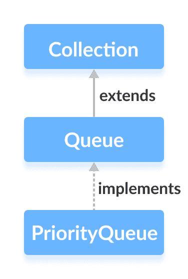

# Java PriorityQueue

> 原文： [https://www.programiz.com/java-programming/priorityqueue](https://www.programiz.com/java-programming/priorityqueue)

#### 在本教程中，我们将借助示例学习 Java 集合框架的 PriorityQueue 类。

`PriorityQueue`类提供[堆数据结构](/dsa/heap-data-structure "Heap data structure")的功能。

它实现了[队列接口](/java-programming/queue "Java Queue Interface")。



与普通队列不同，优先级队列元素是按排序顺序检索的。

假设我们要按升序检索元素。 在这种情况下，优先级队列的头部将是最小的元素。 一旦检索到此元素，下一个最小的元素将是队列的开头。

重要的是要注意，优先级队列的元素可能未排序。 但是，元素总是按排序顺序检索。

* * *

## 创建 PriorityQueue

为了创建优先级队列，我们​​必须导入`java.util.PriorityQueue`包。 导入程序包后，可以使用以下方法在 Java 中创建优先级队列。

```java
PriorityQueue<Integer> numbers = new PriorityQueue<>(); 
```

在这里，我们创建了一个没有任何参数的优先级队列。 在这种情况下，优先级队列的头部是队列的最小元素。 并且元素以升序从队列中删除。

但是，我们可以在`Comparator`界面的帮助下自定义元素的顺序。 我们将在本教程的后面部分中对此进行了解。

* * *

## PriorityQueue 方法

`PriorityQueue`类提供`Queue`接口中存在的所有方法的实现。

* * *

## 将元素插入 PriorityQueue

*   `add()`-将指定的元素插入队列。 如果队列已满，则会引发异常。
*   `offer()`-将指定的元素插入队列。 如果队列已满，则返回`false`。

例如，

```java
import java.util.PriorityQueue;

class Main {
    public static void main(String[] args) {

        // Creating a priority queue
        PriorityQueue<Integer> numbers = new PriorityQueue<>();

        // Using the add() method
        numbers.add(4);
        numbers.add(2);
        System.out.println("PriorityQueue: " + numbers);

        // Using the offer() method
        numbers.offer(1);
        System.out.println("Updated PriorityQueue: " + numbers);
    }
} 
```

**输出**

```java
PriorityQueue: [2, 4]
Updated PriorityQueue: [1, 4, 2] 
```

在这里，我们创建了一个名为`number`的优先级队列。 我们已将 4 和 2 插入队列。

尽管在 2 之前插入了 4，但是队列的头是 2。这是因为优先级队列的头是队列的最小元素。

然后，我们将 1 插入队列。 现在重新排列了队列，以将最小的元素 1 存储到队列的开头。

* * *

## 访问 PriorityQueue 元素

要从优先级队列访问元素，我们可以使用`peek()`方法。 此方法返回队列的开头。 例如，

```java
import java.util.PriorityQueue;

class Main {
    public static void main(String[] args) {

        // Creating a priority queue
        PriorityQueue<Integer> numbers = new PriorityQueue<>();
        numbers.add(4);
        numbers.add(2);
        numbers.add(1);
        System.out.println("PriorityQueue: " + numbers);

        // Using the peek() method
        int number = numbers.peek();
        System.out.println("Accessed Element: " + number);
    }
} 
```

**Output**

```java
PriorityQueue: [1, 4, 2]
Accessed Element: 1 
```

* * *

## 删除 PriorityQueue 元素

*   `remove()`-从队列中删除指定的元素
*   `poll()`-返回并删除队列的开头

For example,

```java
import java.util.PriorityQueue;

class Main {
    public static void main(String[] args) {

        // Creating a priority queue
        PriorityQueue<Integer> numbers = new PriorityQueue<>();
        numbers.add(4);
        numbers.add(2);
        numbers.add(1);
        System.out.println("PriorityQueue: " + numbers);

        // Using the remove() method
        boolean result = numbers.remove(2);
        System.out.println("Is the element 2 removed? " + result);

        // Using the poll() method
        int number = numbers.poll();
        System.out.println("Removed Element Using poll(): " + number);
    }
} 
```

**Output**

```java
PriorityQueue: [1, 4, 2]
Is the element 2 removed? true
Removed Element Using poll(): 1 
```

* * *

## 遍历 PriorityQueue

要遍历优先级队列的元素，我们可以使用`iterator()`方法。 为了使用此方法，我们必须导入`java.util.Iterator`包。 例如，

```java
import java.util.PriorityQueue;
import java.util.Iterator;

class Main {
    public static void main(String[] args) {

        // Creating a priority queue
        PriorityQueue<Integer> numbers = new PriorityQueue<>();
        numbers.add(4);
        numbers.add(2);
        numbers.add(1);
        System.out.print("PriorityQueue using iterator(): ");

        //Using the iterator() method
        Iterator<Integer> iterate = numbers.iterator();
        while(iterate.hasNext()) {
            System.out.print(iterate.next());
            System.out.print(", ");
        }
    }
} 
```

**Output**

```java
PriorityQueue using iterator(): 1, 4, 2, 
```

* * *

## 其他 PriorityQueue 方法

| 方法 | 内容描述 |
| `contains(element)` | 在优先级队列中搜索指定的元素。 如果找到该元素，则返回`true`，否则返回`false`。 |
| `size()` | 返回优先级队列的长度。 |
| `toArray()` | 将优先级队列转换为数组并返回它。 |

* * *

## PriorityQueue 比较器

在以上所有示例中，优先级队列元素都是按自然顺序（升序）检索的。 但是，我们可以自定义此排序。

为此，我们需要创建自己的比较器类来实现`Comparator`接口。 例如，

```java
import java.util.PriorityQueue;
import java.util.Comparator;
class Main {
    public static void main(String[] args) {

        // Creating a priority queue
        PriorityQueue<Integer> numbers = new PriorityQueue<>(new CustomComparator());
        numbers.add(4);
        numbers.add(2);
        numbers.add(1);
        numbers.add(3);
        System.out.print("PriorityQueue: " + numbers);
    }
}

class CustomComparator implements Comparator<Integer> {

    @Override
    public int compare(Integer number1, Integer number2) {
        int value =  number1.compareTo(number2);
        // elements are sorted in reverse order
        if (value > 0) {
            return -1;
        }
        else if (value < 0) {
            return 1;
        }
        else {
            return 0;
        }
    }
} 
```

**Output**

```java
PriorityQueue: [4, 3, 1, 2] 
```

在上面的示例中，我们创建了一个优先级队列，将`CustomComparator`类作为参数传递。

`CustomComparator`类实现`Comparator`接口。

然后，我们重写`compare()`方法。 现在，该方法使元素的头成为最大数量。

要了解有关比较器的更多信息，请访问 [Java Comparator](https://docs.oracle.com/javase/8/docs/api/java/util/Comparator.html) 。