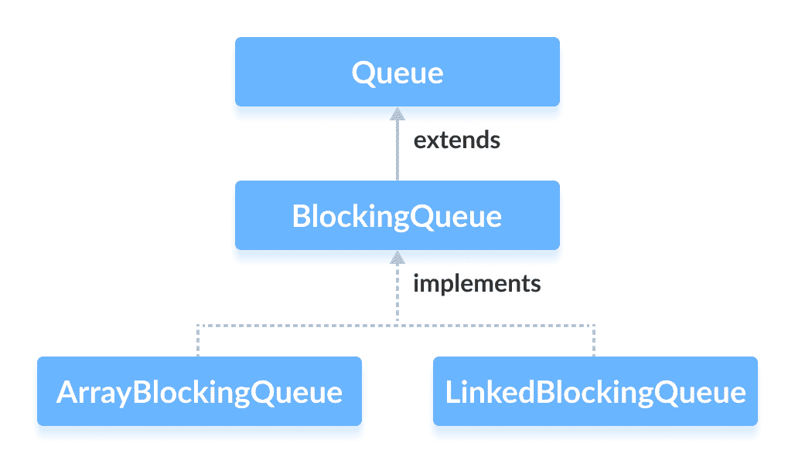

# Java `BlockingQueue`

> 原文： [https://www.programiz.com/java-programming/blockingqueue](https://www.programiz.com/java-programming/blockingqueue)

#### 在本教程中，我们将学习 Java `BlockingQueue`接口及其方法。

Java `Collections`框架的`BlockingQueue`接口扩展了`Queue`接口。 它允许任何操作等待成功执行。

例如，如果我们要从空队列中删除元素，则阻塞队列允许删除操作等待，直到队列中包含一些要删除的元素。

* * *

## 实现`BlockingQueue`的类

由于`BlockingQueue`是一个接口，我们无法提供它的直接实现。

为了使用`BlockingQueue`的功能，我们需要使用实现它的类。

*   [ArrayBlockingQueue](/java-programming/arrayblockingqueue "Java ArrayBlockingQueue Class")
*   [LinkedBlockingQueue](/java-programming/linkedblockingqueue "Java LinkedBlockingQueue Class")



* * *

## 如何使用阻塞队列？

为了使用`BlockingQueue`，我们必须导入`java.util.concurrent.BlockingQueue`包。

```java
// Array implementation of BlockingQueue
BlockingQueue<String> animal1 = new ArraryBlockingQueue<>();

// LinkedList implementation of BlockingQueue
BlockingQueue<String> animal2 = new LinkedBlockingQueue<>(); 
```

在这里，我们分别创建了类别为`ArrayBlockingQueue`和`LinkedBlockingQueue`的对象`animal1`和`animal2`。 这些对象可以使用`BlockingQueue`接口的功能。

* * *

## `BlockingQueue`的方法

根据队列是满还是空，阻塞队列的方法可以分为 3 类：

### 引发异常的方法

*   `add()` - 在队列的末尾将元素插入到阻塞队列。 如果队列已满，则引发异常。
*   `element()` - 返回阻塞队列的开头。 如果队列为空，则引发异常。
*   `remove()` - 从阻塞队列中删除一个元素。 如果队列为空，则引发异常。

* * *

### 返回一些值的方法

*   `offer()` - 将指定的元素插入到队列末尾的阻塞队列中。 如果队列已满，则返回`false`。
*   `peek()` - 返回阻塞队列的开头。 如果队列为空，则返回`null`。
*   `poll()` - 从阻塞队列中删除一个元素。 如果队列为空，则返回`null`。

**`offer()`和`poll()`**

`offer()`和`poll()`方法可以与超时一起使用。 也就是说，我们可以传递时间单位作为参数。 例如，

```java
offer(value, 100, milliseconds) 
```

这里，

*   `value`是要插入队列的元素
*   并且我们将超时设置为 100 毫秒

这意味着`offer()`方法将尝试在`100`毫秒内将元素插入到阻塞队列中。 如果无法在 100 毫秒内插入元素，则该方法返回`false`。

**注意**：代替`milliseconds`，我们也可以使用以下时间单位：`offer()`和`offer() poll()`方法。

* * *

### 阻塞操作的方法

`BlockingQueue`还提供了阻止操作并等待队列已满或为空的方法。

*   `put()` - 将元素插入阻塞队列。 如果队列已满，它将等待直到队列有空间插入元素。
*   `take()` - 从阻塞队列中删除并返回一个元素。 如果队列为空，它将等待直到队列中有要删除的元素。

假设我们想将元素插入队列。 如果队列已满，则`put()`方法将等待，直到队列有空间插入元素。

同样，如果我们要从队列中删除元素。 如果队列为空，则`take()`方法将等待，直到队列包含要删除的元素。

* * *

## `ArrayBlockingQueue`中`BlockingQueue`的实现

```java
import java.util.concurrent.BlockingQueue;
import java.util.concurrent.ArrayBlockingQueue;

class Main {

    public static void main(String[] args) {
      // Create a blocking queue using the ArrayBlockingQueue
      BlockingQueue<Integer> numbers = new ArrayBlockingQueue<>(5);

      try {
        // Insert element to blocking queue
        numbers.put(2);
        numbers.put(1);
        numbers.put(3);
        System.out.println("BLockingQueue: " + numbers);

        // Remove Elements from blocking queue
        int removedNumber = numbers.take();
        System.out.println("Removed Number: " + removedNumber);
      }

      catch(Exception e) {
          e.getStackTrace();
      }
    }
} 
```

**输出**

```java
BlockingQueue: [2, 1, 3]
Removed Element: 2 
```

要了解有关`ArrayBlockingQueue`的更多信息，请访问 [Java ArrayBlockingQueue](/java-programming/arrayblockingqueue "Java ArrayBlockingQueue Class") 。

* * *

## 为什么选择`BlockingQueue`？

在 Java 中，`BlockingQueue`被视为**线程安全的**集合。 这是因为它在多线程操作中可能会有所帮助。

假设一个线程正在将元素插入队列，而另一个线程正在从队列中删除元素。

现在，如果第一个线程运行速度较慢，则阻塞队列可使第二个线程等待，直到第一个线程完成其操作。