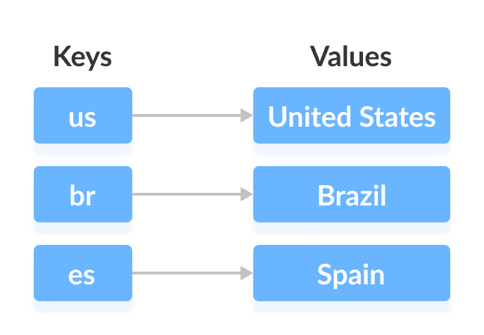
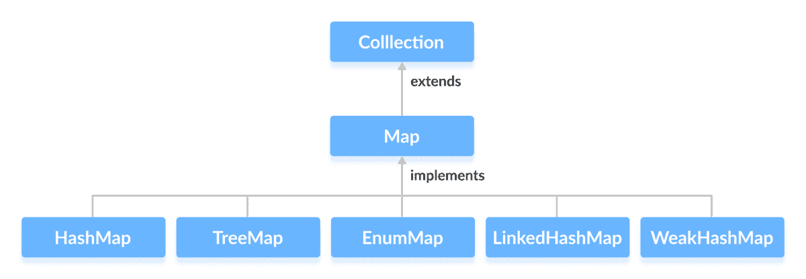
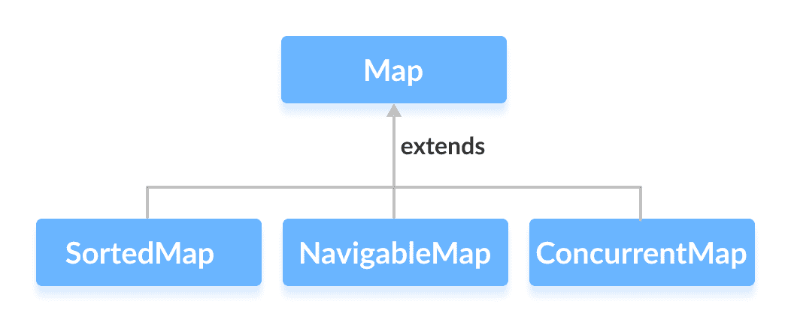

# Java `Map`接口

> 原文： [https://www.programiz.com/java-programming/map](https://www.programiz.com/java-programming/map)

#### 在本教程中，我们将学习 Java `Map`接口及其方法。

Java 集合框架的`Map`接口提供了映射数据结构的功能。

它实现了`Collection`接口。

* * *

## 映射的工作

在 Java 中，`Map`的元素存储在**键/值**对中。 **键**是与各个**值**相关联的唯一值。

映射不能包含重复的键。 并且，每个键都与一个值相关联。



我们可以使用与它们关联的键来访问和修改值。

在上图中，我们具有以下值：`Amarica`，`Brazil`和`Spain`。 并且我们有相应的密钥：`，`，`，`和`和`。

现在，我们可以使用它们的对应键访问这些值。

**注意**： `Map`接口维护 3 个不同的集合：

*   密钥集
*   一组值
*   键/值关联（映射）的集合。

因此，我们可以分别访问键，值和关联。

* * *

## 实现`Map`的类

由于`Map`是一个接口，因此我们无法从中创建对象。

为了使用`Map`接口的功能，我们可以使用以下类：

*   [`HashMap`](/java-programming/hashmap "Java HashMap class")
*   [`EnumMap`](/java-programming/enummap "Java EnumMap Class")
*   [`LinkedHashMap`](/java-programming/linkedhashmap "Java LinkedHashMap class")
*   [`WeakHashMap`](/java-programming/weakhashmap "Java WeakhashMap class")
*   [`TreeMap`](/java-programming/treemap "Java TreeMap class")

这些类在集合框架中定义，并实现`Map`接口。



* * *

## 扩展`Map`的接口

`Map`接口还通过以下子接口扩展：

*   [SortedMap](/java-programming/sortedmap "Java SortedMap Interface")
*   [NavigableMap](/java-programming/navigablemap "Java NavigableMap Interface")
*   [ConcurrentMap](/java-programming/concurrentmap "Java ConcurrentMap Interface")



* * *

## 如何使用映射？

在 Java 中，必须导入`java.util.Map`包才能使用`Map`。 导入包后，将按照以下方法创建映射。

```java
// Map implementation using HashMap
Map<Key, Value> numbers = new HashMap<>(); 
```

在上面的代码中，我们创建了一个名为`number`的`Map`。 我们已经使用`HashMap`类来实现`Map`接口。

这里，

*   `key`-用于关联映射中每个元素（值）的唯一标识符
*   `value`-映射中与按键相关联的元素

* * *

## 映射方法

`Map`接口包含`Collection`接口的所有方法。 这是因为`Collection`是`Map`的超级接口。

除了`Collection`接口中可用的方法外，`Map`接口还包括以下方法：

*   **`put(K, V)`**-将键`K`和值`V`的关联插入到映射中。 如果键已经存在，则新值将替换旧值。
*   **`putAll()`**-将指定映射中的所有条目插入此映射。
*   **`putIfAbsent(K, V)`**-如果键`K`尚未与值`V`关联，则插入关联。
*   **`get(K)`**-返回与指定键`K`关联的值。 如果找不到密钥，则返回`null`。
*   **`getOrDefault(K, defaultValue)`**-返回与指定键`K`关联的值。 如果未找到密钥，则返回`defaultValue`。
*   **`containsKey(K)`**-检查映射中是否存在指定的键`K`。
*   **`containsValue(V)`**-检查指定值`V`是否存在于映射中。
*   **`replace(K, V)`**-用新的指定值`V`替换键`K`的值。
*   **`replace(K, oldValue, newValue)`**-仅当键`K`时，才将键`K`的值替换为新值`newValue`与值`oldValue`关联。
*   **`remove(K)`**-从键`K`表示的映射中删除条目。
*   **`remove(K, V)`**-从映射中删除具有与值`V`关联的键`K`的条目。
*   **`keySet()`**-返回映射中存在的所有键的集合。
*   **`values()`**-返回映射中存在的所有值的集合。
*   **`entrySet()`**-返回映射中存在的所有键/值映射的集合。

* * *

## `Map`接口的实现

**1.`HashMap`实现类**

```java
import java.util.Map;
import java.util.HashMap;

class Main {

    public static void main(String[] args) {
        // Creating a map using the HashMap
        Map<String, Integer> numbers = new HashMap<>();

        // Insert elements to the map
        numbers.put("One", 1);
        numbers.put("Two", 2);
        System.out.println("Map: " + numbers);

        // Access keys of the map
        System.out.println("Keys: " + numbers.keySet());

        // Access values of the map
        System.out.println("Values: " + numbers.values());

        // Access entries of the map
        System.out.println("Entries: " + numbers.entrySet());

        // Remove Elements from the map
        int value = numbers.remove("Two");
        System.out.println("Removed Value: " + value);
    }
} 
```

**输出**

```java
Map: {One=1, Two=2}
Keys: [One, Two]
Values: [1, 2]
Entries: [One=1, Two=2]
Removed Value: 2 
```

要了解有关`HashMap`的更多信息，请访问 [Java HashMap](/java-programming/hashmap "Java HashMap Class") 。

* * *

**2.`TreeMap`实现类**

```java
import java.util.Map;
import java.util.TreeMap;

class Main {

    public static void main(String[] args) {
        // Creating Map using TreeMap
        Map<String, Integer> values = new TreeMap<>();

        // Insert elements to map
        values.put("Second", 2);
        values.put("First", 1);
        System.out.println("Map using TreeMap: " + values);

        // Replacing the values
        values.replace("First", 11);
        values.replace("Second", 22);
        System.out.println("New Map: " + values);

        // Remove elements from the map
        int removedValue = values.remove("First");
        System.out.println("Removed Value: " + removedValue);
    }
} 
```

**输出**：

```java
Map using TreeMap: {First=1, Second=2}
New Map: {First=11, Second=22}
Removed Value: 11 
```

要了解有关`TreeMap`的更多信息，请访问 [Java TreeMap](/java-programming/treemap "Java TreeMap Class") 。