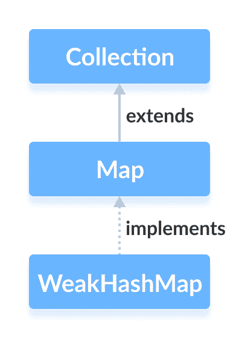

# Java `WeakHashMap`

> 原文： [https://www.programiz.com/java-programming/weakhashmap](https://www.programiz.com/java-programming/weakhashmap)

#### 在本教程中，我们将借助示例学习 Java `WeakHashMap`及其操作。 我们还将了解`WeakHashMap`和`HashMap`之间的区别

Java 集合框架的`WeakHashMap`类提供了哈希表数据结构的功能。

它实现了[`Map`接口](/java-programming/map "Java Map Interface")。



**注意**：弱哈希映射的键为`WeakReference`类型。

如果引用不再在程序中使用，则弱引用类型的对象可以在 Java 中被垃圾回收。

让我们学习首先创建一个弱哈希映射。 然后，我们将学习它与哈希映射的区别。

* * *

## 创建一个`WeakHashMap`

为了创建一个弱哈希表，我们必须首先导入`java.util.WeakHashMap`包。 导入包后，可以使用以下方法在 Java 中创建弱哈希表。

```java
//WeakHashMap creation with capacity 8 and load factor 0.6
WeakHashMap<Key, Value> numbers = new WeakHashMap<>(8, 0.6); 
```

在上面的代码中，我们创建了一个名为`number`的弱哈希映射。

这里，

*   `key` - 用于关联映射中每个元素（值）的唯一标识符
*   `value` - 映射中与按键相关联的元素

注意部分`new WeakHashMap<>(8, 0.6)`。 在此，第一个参数是`capcity`，第二个参数是`loadFactor`。

*   **`capcity`** - 此映射的容量为 8。意味着，它可以存储 8 个条目。
*   **`loadFactor`**  - 此映射的负载因子为 0.6。 这意味着只要我们的哈希表填充了 60%，条目就会被移到新哈希表中，其大小是原始哈希表的两倍。

**默认容量和负载系数**

可以在不定义其容量和负载因子的情况下创建弱哈希映射。 例如，

```java
// WeakHashMap with default capacity and load factor
WeakHashMap<Key, Value> numbers1 = new WeakHashMap<>(); 
```

默认，

*   映射的容量将为 16
*   负载系数将为 0.75

* * *

## `HashMap`和`WeakHashMap`之间的差异

让我们看看 Java 中弱哈希表的实现。

```java
import java.util.WeakHashMap;

class Main {
    public static void main(String[] args) {
        // Creating WeakHashMap of numbers
        WeakHashMap<String, Integer> numbers = new WeakHashMap<>();

        String two = new String("Two");
        Integer twoValue = 2;
        String four = new String("Four");
        Integer fourValue = 4;

        // Inserting elements
        numbers.put(two, twoValue);
        numbers.put(four, fourValue);
        System.out.println("WeakHashMap: " + numbers);

        // Make the reference null
        two = null;

        // Perform garbage collection
        System.gc();

        System.out.println("WeakHashMap after garbage collection: " + numbers);
    }
} 
```

**输出**

```java
WeakHashMap: {Four=4, Two=2}
WeakHashMap after garbage collection: {Four} 
```

如我们所见，当弱哈希映射的键`Two`设置为`null`并执行垃圾回收时，该键将被删除。

这是因为与哈希映射不同，弱哈希映射的键是**弱引用**类型。 这意味着如果不再使用映射条目，则垃圾收集器将删除该条目。 这对于节省资源很有用。

现在让我们在哈希映射中查看相同的实现。

```java
import java.util.HashMap;

class Main {
    public static void main(String[] args) {
        // Creating HashMap of even numbers
        HashMap<String, Integer> numbers = new HashMap<>();

        String two = new String("Two");
        Integer twoValue = 2;
        String four = new String("Four");
        Integer fourValue = 4;

        // Inserting elements
        numbers.put(two, twoValue);
        numbers.put(four, fourValue);
        System.out.println("HashMap: " + numbers);

        // Make the reference null
        two = null;

        // Perform garbage collection
        System.gc();

        System.out.println("HashMap after garbage collection: " + numbers);
    }
} 
```

**输出**：

```java
HashMap: {Four=4, Two=2}
HashMap after garbage collection: {Four=4, Two=2} 
```

在此，当哈希映射的键`Two`被设置为`null`并执行垃圾收集时，该键不会被删除。

这是因为与弱哈希表不同，哈希表的键是**强引用**类型。 这意味着垃圾回收器不会删除映射的条目，即使不再使用该条目的键。

**注意**：哈希映射和弱哈希映射的所有功能都是相似的，只是弱哈希映射的键是弱引用，而哈希映射的键是强引用。

* * *

## 从其他映射创建`WeakHashMap`

这是我们可以从其他映射创建弱哈希表的方法。

```java
import java.util.HashMap;
import java.util.WeakHashMap;

class Main {
    public static void main(String[] args) {
        // Creating a hashmap of even numbers
        HashMap<String, Integer> evenNumbers = new HashMap<>();

        String two = new String("Two");
        Integer twoValue = 2;
        evenNumbers.put(two, twoValue);
        System.out.println("HashMap: " + evenNumbers);

        // Creating a weak hash map from other hashmap
        WeakHashMap<String, Integer> numbers = new WeakHashMap<>(evenNumbers);

        System.out.println("WeakHashMap: " + numbers);
    }
} 
```

**输出**：

```java
HashMap: {Two=2}
WeakHashMap: {Two=2} 
```

* * *

## `WeakHashMap`的方法

`WeakHashMap`类提供允许我们在映射上执行各种操作的方法。

* * *

## 将元素插入`WeakHashMap`

*   `put()` - 将指定的键/值映射插入到映射中
*   `putAll()` - 将指定映射中的所有条目插入此映射中
*   `putIfAbsent()` - 如果映射中不存在指定的键，则将指定的键/值映射插入到映射中

例如，

```java
import java.util.WeakHashMap;

class Main {
    public static void main(String[] args) {
        // Creating WeakHashMap of even numbers
        WeakHashMap<String, Integer> evenNumbers = new WeakHashMap<>();

        String two = new String("Two");
        Integer twoValue = 2;

        // Using put()
        evenNumbers.put(two, twoValue);

        String four = new String("Four");
        Integer fourValue = 4;

        // Using putIfAbsent()
        evenNumbers.putIfAbsent(four, fourValue);
        System.out.println("WeakHashMap of even numbers: " + evenNumbers);

        //Creating WeakHashMap of numbers
        WeakHashMap<String, Integer> numbers = new WeakHashMap<>();

        String one = new String("One");
        Integer oneValue = 1;
        numbers.put(one, oneValue);

        // Using putAll()
        numbers.putAll(evenNumbers);
        System.out.println("WeakHashMap of numbers: " + numbers);
    }
} 
```

**输出**：

```java
WeakHashMap of even numbers: {Four=4, Two=2}
WeakHashMap of numbers: {Two=2, Four=4, One=1} 
```

* * *

## 访问`WeakHashMap`元素

**1.使用`entrySet()`，`keySet()`和`values()`**

*   `entrySet()` - 返回一组所有键/值映射的映射
*   `keySet()` - 返回映射的所有键的集合
*   `values()` - 返回一组所有映射值

例如：

```java
import java.util.WeakHashMap;

class Main {
    public static void main(String[] args) {
        // Creating WeakHashMap of even numbers
        WeakHashMap<String, Integer> numbers = new WeakHashMap<>();

        String one = new String("One");
        Integer oneValue = 1;
        numbers.put(one, oneValue);

        String two = new String("Two");
        Integer twoValue = 2;
        numbers.put(two, twoValue);

        System.out.println("WeakHashMap: " + numbers);

        // Using entrySet()
        System.out.println("Key/Value mappings: " + numbers.entrySet());

        // Using keySet()
        System.out.println("Keys: " + numbers.keySet());

        // Using values()
        System.out.println("Values: " + numbers.values());
    }
} 
```

**输出**：

```java
WeakHashMap: {Two=2, One=1}
Key/Value mappings: [Two=2, One=1]
Keys: [Two, One]
Values: [1, 2] 
```

**2.使用`get()`和`getOrDefault()`**

*   `get()` - 返回与指定键关联的值。 如果找不到键，则返回`null`。
*   `getOrDefault()` - 返回与指定键关联的值。 如果找不到键，则返回指定的默认值。

例如：

```java
import java.util.WeakHashMap;

class Main {
    public static void main(String[] args) {
        // Creating WeakHashMap of even numbers
        WeakHashMap<String, Integer> numbers = new WeakHashMap<>();

        String one = new String("One");
        Integer oneValue = 1;
        numbers.put(one, oneValue);

        String two = new String("Two");
        Integer twoValue = 2;
        numbers.put(two, twoValue);

        System.out.println("WeakHashMap: " + numbers);

        // Using get()
        int value1 = numbers.get("Two");
        System.out.println("Using get(): " + value1);

        // Using getOrDefault()
        int value2 = numbers.getOrDefault("Four", 4);
        System.out.println("Using getOrDefault(): " + value2);

    }
} 
```

**输出**：

```java
WeakHashMap: {Two=2, One=1}
Using get(): 2
Using getOrDefault(): 4 
```

* * *

## 删除`WeakHashMap`元素

*   `remove(key)` - 返回并从映射中删除与指定键关联的条目
*   `remove(key, value)` - 仅当指定键映射到指定值并返回布尔值时，才从映射中删除条目

例如：

```java
import java.util.WeakHashMap;

class Main {
    public static void main(String[] args) {
        // Creating WeakHashMap of even numbers
        WeakHashMap<String, Integer> numbers = new WeakHashMap<>();

        String one = new String("One");
        Integer oneValue = 1;
        numbers.put(one, oneValue);

        String two = new String("Two");
        Integer twoValue = 2;
        numbers.put(two, twoValue);

        System.out.println("WeakHashMap: " + numbers);

        // Using remove() with single parameter
        int value = numbers.remove("Two");
        System.out.println("Removed value: " + value);

        // Using remove() with 2 parameters
        boolean result = numbers.remove("One", 3);
        System.out.println("Is the entry {One=3} removed? " + result);

        System.out.println("Updated WeakHashMap: " + numbers);
    }
} 
```

**输出**：

```java
WeakHashMap: {Two=2, One=1}
Removed value: 2
Is the entry {One=3} removed? False
Updated WeakHashMap: {One=1} 
```

* * *

## `WeakHashMap`的其他方法

| 方法 | 描述 |
| --- | --- |
| `clear()` | 从映射中删除所有条目 |
| `containsKey()` | 检查映射是否包含指定的键并返回布尔值 |
| `containsValue()` | 检查映射是否包含指定的值并返回布尔值 |
| `size()` | 返回映射的大小 |
| `isEmpty()` | 检查映射是否为空并返回布尔值 |

* * *

要了解更多信息，请访问 [Java `WeakHashMap`（官方 Java 文档）](https://docs.oracle.com/javase/7/docs/api/java/util/WeakHashMap.html)。