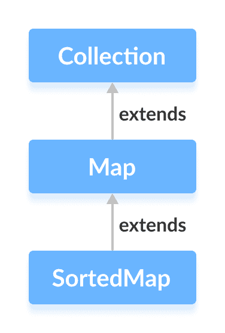
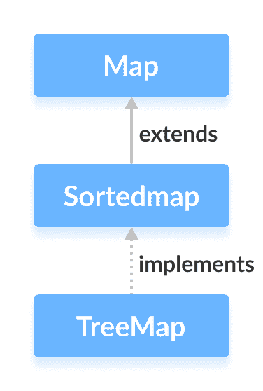

# Java `SortedMap`接口

> 原文： [https://www.programiz.com/java-programming/sortedmap](https://www.programiz.com/java-programming/sortedmap)

#### 在本教程中，我们将学习 Java `SortedMap`接口及其方法。

Java 集合框架的`SortedMap`接口可对存储在映射中的键进行排序。

它扩展了[`Map`接口](/java-programming/map "Java Map interface")。



* * *

## 实现`SortedMap`的类

由于`SortedMap`是一个接口，因此我们无法从中创建对象。

为了使用`SortedMap`接口的功能，我们需要使用实现它的类`TreeMap`。



* * *

## 如何使用`SortedMap`？

要使用`SortedMap`，我们必须首先导入`java.util.SortedMap`包。 导入包后，可以按照以下方法创建排序的映射。

```java
// SortedMap implementation by TreeMap class
SortedMap<Key, Value> numbers = new TreeMap<>(); 
```

我们使用`TreeMap`类创建了一个名为`number`的排序映射。

这里，

*   `key`-用于关联映射中每个元素（值）的唯一标识符
*   `value`-映射中与按键相关联的元素

在这里，我们没有使用任何参数来创建排序的映射。 因此，映射将自然排序（升序）。

* * *

## `SortedMap`的方法

`SortedMap`接口包含`Map`接口的所有方法。 这是因为`Map`是`SortedMap`的超级接口。

除了所有这些方法，以下是`SortedMap`接口专用的方法。

*   **`comparator()`**-返回一个可用于对映射中的键进行排序的比较器
*   **`firstKey()`**-返回已排序映射的第一个键
*   **`lastKey()`**-返回已排序映射的最后一个键
*   **`headMap(key)`**-返回其键号小于指定的`key`的映射的所有条目
*   **`tailMap(key)`**-返回其键大于或等于指定的`key`的映射的所有条目
*   **`subMap(key1, key2)`**-返回其键位于`key1`和`key2`之间的映射的所有条目，包括`key1`

要了解更多信息，请访问 [Java `SortedMap`（Java 官方文档）](https://docs.oracle.com/javase/7/docs/api/java/util/SortedMap.html)。

* * *

## `TreeMap`类中`SortedMap`的实现

```java
import java.util.SortedMap;
import java.util.TreeMap;

class Main {

    public static void main(String[] args) {
        // Creating SortedMap using TreeMap
        SortedMap<String, Integer> numbers = new TreeMap<>();

        // Insert elements to map
        numbers.put("Two", 2);
        numbers.put("One", 1);
        System.out.println("SortedMap: " + numbers);

        // Access the first key of the map
        System.out.println("First Key: " + numbers.firstKey());

        // Access the last key of the map
        System.out.println("Last Key: " + numbers.lastKey());

        // Remove elements from the map
        int value = numbers.remove("One");
        System.out.println("Removed Value: " + value);
    }
} 
```

**输出**

```java
SortedMap: {One=1, Two=2}
First Key: One
Last Key: Two
Removed Value: 1 
```

要了解有关`TreeMap`的更多信息，请访问 [Java TreeMap](/java-programming/treemap "Java TreeMap Class") 。

* * *

现在我们知道了`SortedMap`接口，我们将使用`TreeMap`类学习其实现。