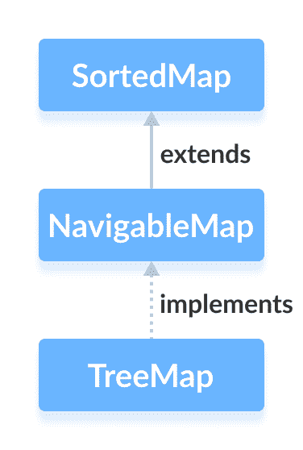

# Java `NavigableMap`接口

> 原文： [https://www.programiz.com/java-programming/navigablemap](https://www.programiz.com/java-programming/navigablemap)

#### 在本教程中，我们将通过一个示例学习 Java `NavigableMap`接口及其方法。

Java 集合框架的`NavigableMap`接口提供了在映射条目之间导航的功能。

它被视为 [SortedMap](/java-programming/sortedmap "Java SortedMap Interface") 的一种。

* * *

## 实现`NavigableMap`的类

由于`NavigableMap`是一个接口，因此我们无法从中创建对象。

为了使用`NavigableMap`接口的功能，我们需要使用实现`NavigableMap`的`TreeMap`类。



* * *

## 如何使用`NavigableMap`？

在 Java 中，我们必须导入`java.util.NavigableMap`包才能使用`NavigableMap`。 导入包后，将按照以下方法创建可导航的映射。

```java
// NavigableMap implementation by TreeMap class
NavigableMap<Key, Value> numbers = new TreeMap<>(); 
```

在上面的代码中，我们创建了一个名为`TreeMap`类的`number`的可导航映射。

这里，

*   `key`-用于关联映射中每个元素（值）的唯一标识符
*   `value`-映射中与按键相关联的元素

* * *

## `NavigableMap`的方法

`NavigableMap`被认为是`SortedMap`的一种。 这是因为`NavigableMap`扩展了`SortedMap`接口。

因此，所有`SortedMap`方法在`NavigableMap`中也可用。 要了解`SortedMap`中如何定义这些方法，请访问 [Java SortedMap](/java-programming/sortedmap) 。

但是，`SortedMap`（`headMap()`，`tailMap()`和`subMap()`）中的某些方法在`NavigableMap`中定义不同。

让我们看看如何在`NavigableMap`中定义这些方法。

* * *

### `headMap(key, booleanValue)`

`headMap()`方法返回在指定的`key`（作为参数传递）之前与所有这些键关联的可导航映射的所有条目。

`booleanValue`是可选参数。 其默认值为`false`。

如果将`true`作为`booleanValue`传递，则该方法返回与所有在指定的`key`之前的所有密钥相关联的条目，包括与指定的`key`。

* * *

### `tailMap(key, booleanValue)`

`tailMap()`方法返回与指定键`key`（作为参数传递）之后的所有那些键相关联的可导航映射的所有条目，包括与指定`key`相关的条目 。

`booleanValue`是可选参数。 其默认值为`true`。

如果`false`作为`booleanValue`传递，则该方法将返回指定的`key`之后与这些密钥相关的所有条目，而不包括与指定的`key`。

* * *

### `subMap(k1, bv1, k2, bv2)`

`subMap()`方法返回与`k1`和`k2`之间的键相关联的所有条目，包括与`k1`相关联的条目。

`bv1`和`bv2`是可选参数。`bv1`的默认值为`true`，`bv2`的默认值为`false`。

如果`false`作为`bv1`传递，则该方法返回与`k1`和`k2`之间的键相关联的所有条目，而不包括与`k1`相关联的条目。

如果`true`作为`bv2`传递，则该方法返回与`k1`和`k2`之间的键相关联的所有条目，包括与`k1`相关联的条目。

* * *

## 其他方法

`NavigableMap`提供了各种可用于定位映射条目的方法。

*   **`DescendingMap()`** - 反转映射中的条目顺序
*   **`DescendingKeyMap()`** - 反转映射中按键的顺序
*   **`ceilingEntry()`** - 返回其键大于或等于指定键的所有条目中键最低的条目
*   **`ceilingKey()`** - 返回大于或等于指定键的那些键中的最低键
*   **`floorEntry()`** - 返回其键小于或等于指定键的所有条目中具有最高键的条目
*   **`floorKey()`** - 返回小于或等于指定键的那些键中的最高键
*   **`upperEntry()`**： - 返回其键大于指定键的所有条目中键最低的条目
*   **`upperKey()`**： - 返回大于指定键的那些键中的最低键
*   **`lowerEntry()`**： - 返回其键小于指定键的所有条目中具有最高键的条目
*   **`lowerKey()`**： - 返回小于指定键的那些键中的最高键
*   **`firstEntry()`**： - 返回映射的第一个条目（具有最低键的条目）
*   **`lastEntry()`**： - 返回映射的最后一个条目（具有最高键的条目）
*   **`pollFirstEntry()`**： - 返回并删除映射的第一个条目
*   **`pollLastEntry()`**： - 返回并删除映射的最后一个条目

要了解更多信息，请访问 [Java `NavigableMap`（Java 官方文档）](https://docs.oracle.com/javase/7/docs/api/java/util/NavigableMap.html)。

* * *

## `TreeMap`类中`NavigableMap`的实现

```java
import java.util.NavigableMap;
import java.util.TreeMap;

class Main {

    public static void main(String[] args) {
        // Creating NavigableMap using TreeMap
        NavigableMap<String, Integer> numbers = new TreeMap<>();

        // Insert elements to map
        numbers.put("Two", 2);
        numbers.put("One", 1);
        numbers.put("Three", 3);
        System.out.println("NavigableMap: " + numbers);

        // Access the first entry of the map
        System.out.println("First Entry: " + numbers.firstEntry());

        // Access the last entry of the map
        System.out.println("Last Entry: " + numbers.lastEntry());

        // Remove the first entry from the map
        System.out.println("Removed First Entry: " + numbers.pollFirstEntry());

        // Remove the last entry from the map
        System.out.println("Removed Last Entry: " + numbers.pollLastEntry());
    }
} 
```

**输出**

```java
NavigableMap: {One=1, Three=3, Two=2}
First Entry: One=1
Last Entry: Two=2
Removed First Entry: One=1
Removed Last Entry: Two=2 
```

要了解有关`TreeMap`的更多信息，请访问 [Java TreeMap](/java-programming/treemap "Java TreeMap class") 。

* * *

现在我们知道了`NavigableMap`接口，我们将在下一个教程中详细了解如何使用`TreeMap`类实现该接口。