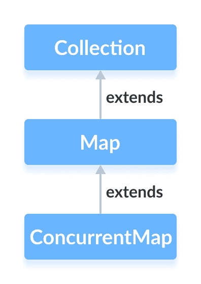

# Java `ConcurrentMap`接口

> 原文： [https://www.programiz.com/java-programming/concurrentmap](https://www.programiz.com/java-programming/concurrentmap)

#### 在本教程中，我们将学习 Java `ConcurrentMap`接口及其方法。

Java 集合框架的`ConcurrentMap`接口提供了线程安全的映射。 也就是说，多个线程可以一次访问该映射，而不会影响映射中条目的一致性。

`ConcurrentMap`被称为同步映射。

它扩展了[`Map`接口](/java-programming/map "Java Map Interface")。

* * *

## 实现`ConcurrentMap`的类

由于`ConcurrentMap`是一个接口，因此我们无法从中创建对象。

为了使用`ConcurrentMap`接口的功能，我们需要使用实现它的类`ConcurrentHashMap`。



* * *

## 如何使用`ConcurrentMap`？

要使用`ConcurrentMap`，我们必须首先导入`java.util.concurrent.ConcurrentMap`包。 导入包后，将按照以下方法创建并发映射。

```java
// ConcurrentMap implementation by ConcurrentHashMap
CocurrentMap<Key, Value> numbers = new ConcurrentHashMap<>(); 
```

在上面的代码中，我们创建了一个名为`number`的并发映射。

这里，

*   `key`-用于关联映射中每个元素（值）的唯一标识符
*   `value`-映射中与按键相关联的元素

* * *

## `ConcurrentMap`的方法

`ConcurrentMap`接口包含`Map`接口的所有方法。 这是因为`Map`是`ConcurrentMap`接口的超级接口。

除了所有这些方法，以下是`ConcurrentMap`接口专用的方法。

*   **`putIfAbsent()`**：-如果指定的键/值尚未与任何值关联，则将其插入到映射中。
*   **`compute()`**：-计算指定键及其先前映射值的条目（键/值映射）。
*   **`computeIfAbsent()`**：-如果键尚未与任何值映射，则使用指定函数为指定键计算一个值。
*   **`computeIfPresent()`**：-如果已使用指定值映射键，则为指定键计算新条目（键/值映射）。
*   **`forEach()`**：-访问映射的所有条目并执行指定的操作。
*   **`merge()`**：-如果键已经映射到某个特定值，则将新的指定值与指定键的旧值合并。 如果该键尚未映射，则该方法只需将指定的值与我们的键关联。

要了解更多信息，请访问 [Java `ConcurrentMap`（Java 官方文档）](https://docs.oracle.com/javase/8/docs/api/java/util/concurrent/ConcurrentMap.html#compute-K-java.util.function.BiFunction-)。

* * *

## `ConcurrentHashMap`中`ConcurrentMap`的实现

```java
import java.util.concurrent.ConcurrentMap;
import java.util.concurrent.ConcurrentHashMap;

class Main {

    public static void main(String[] args) {
        // Creating ConcurrentMap using ConcurrentHashMap
        ConcurrentMap<String, Integer> numbers = new ConcurrentHashMap<>();

        // Insert elements to map
        numbers.put("Two", 2);
        numbers.put("One", 1);
        numbers.put("Three", 3);
        System.out.println("ConcurrentMap: " + numbers);

        // Access the value of specified key
        int value = numbers.get("One");
        System.out.println("Accessed Value: " + value);

        // Remove the value of specified key
        int removedValue = numbers.remove("Two");
        System.out.println("Removed Value: " + removedValue);
    }
} 
```

**输出**

```java
ConcurrentMap: {One=1, Two=2, Three=3}
Accessed Value: 1
Removed Value: 2 
```

要了解有关`ConcurrentHashMap`的更多信息，请访问 [Java ConcurrentHashMap](/java-programming/concurrenthashmap "Java ConcurrentHashMap class") 。