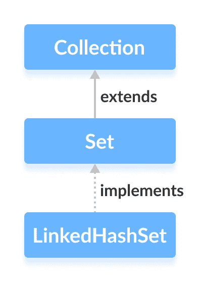

# Java LinkedHashSet

> 原文： [https://www.programiz.com/java-programming/linkedhashset](https://www.programiz.com/java-programming/linkedhashset)

#### 在本教程中，我们将借助示例学习 Java LinkedHashSet 类及其方法。

Java 集合框架的`LinkedHashSet`类提供哈希表和链接列表数据结构的功能。

它实现了 [Set 接口](/java-programming/set "Java Set Interface")。



`LinkedHashSet`的元素存储在类似于 [HashSet](/java-programming/hashset "Java HashSet Class") 的哈希表中。

但是，链接哈希集在内部为其所有元素维护一个双链表。 链表定义了在哈希表中插入元素的顺序。

* * *

## 创建一个 LinkedHashSet

为了创建链接的哈希集，我们必须首先导入`java.util.LinkedHashSet`包。

导入包后，就可以在 Java 中创建链接的哈希集。

```java
// LinkedHashSet with 8 capacity and 0.75 load factor
LinkedHashSet<Integer> numbers = new LinkedHashSet<>(8, 0.75); 
```

在这里，我们创建了一个名为`数字`的链接哈希集。

注意，部分`new LinkedHashSet<>(8, 0.75)`。 在此，第一个参数是**容量**，第二个参数是 **loadFactor** 。

*   **容量**-此哈希集的容量为 8。意味着，它可以存储 8 个元素。
*   **loadFactor** -此哈希集的负载因子为 0.6。 这意味着，只要我们的哈希表填充了 60%，元素就会移到新哈希表中，其大小是原始哈希表的两倍。

**默认容量和负载系数**

无需定义其容量和负载因子就可以创建链接的哈希集。 例如，

```java
// LinkedHashSet with default capacity and load factor
LinkedHashSet<Integer> numbers1 = new LinkedHashSet<>(); 
```

默认，

*   链接哈希集的容量将为 16
*   负载系数将为 0.75

* * *

## 从其他集合创建 LinkedHashSet

这是我们如何创建包含其他集合的所有元素的链接哈希集。

```java
import java.util.LinkedHashSet;
import java.util.ArrayList;

class Main {
    public static void main(String[] args) {
        // Creating an arrayList of even numbers
        ArrayList<Integer> evenNumbers = new ArrayList<>();
        evenNumbers.add(2);
        evenNumbers.add(4);
        System.out.println("ArrayList: " + evenNumbers);

        // Creating a LinkedHashSet from an ArrayList
        LinkedHashSet<Integer> numbers = new LinkedHashSet<>(evenNumbers);
        System.out.println("LinkedHashSet: " + numbers);
    }
} 
```

**输出**

```java
ArrayList: [2, 4]
LinkedHashSet: [2, 4] 
```

* * *

## LinkedHashSet 的方法

`LinkedHashSet`类提供了一些方法，使我们可以对链接的哈希集执行各种操作。

* * *

## 将元素插入 LinkedHashSet

*   `add()`-将指定的元素插入链接的哈希集
*   `addAll()`-将指定集合的​​所有元素插入到链接的哈希集中

例如，

```java
import java.util.LinkedHashSet;

class Main {
    public static void main(String[] args) {
        LinkedHashSet<Integer> evenNumber = new LinkedHashSet<>();

        // Using add() method
        evenNumber.add(2);
        evenNumber.add(4);
        evenNumber.add(6);
        System.out.println("LinkedHashSet: " + evenNumber);

        LinkedHashSet<Integer> numbers = new LinkedHashSet<>();

        // Using addAll() method
        numbers.addAll(evenNumber);
        numbers.add(5);
        System.out.println("New LinkedHashSet: " + numbers);
    }
} 
```

**Output**

```java
LinkedHashSet: [2, 4, 6]
New LinkedHashSet: [2, 4, 6, 5] 
```

* * *

## 访问 LinkedHashSet 元素

要访问链接的哈希集的元素，我们可以使用`iterator()`方法。 为了使用此方法，我们必须导入`java.util.Iterator`包。 例如，

```java
import java.util.LinkedHashSet;
import java.util.Iterator;

class Main {
    public static void main(String[] args) {
        LinkedHashSet<Integer> numbers = new LinkedHashSet<>();
        numbers.add(2);
        numbers.add(5);
        numbers.add(6);
        System.out.println("LinkedHashSet: " + numbers);

        // Calling the iterator() method
        Iterator<Integer> iterate = numbers.iterator();

        System.out.print("LinkedHashSet using Iterator: ");

        // Accessing elements
        while(iterate.hasNext()) {
            System.out.print(iterate.next());
            System.out.print(", ");
        }
    }
} 
```

**Output**

```java
LinkedHashSet: [2, 5, 6]
LinkedHashSet using Iterator: 2, 5, 6, 
```

**注意**：

*   如果链接的哈希集中存在下一个元素，则`hasNext()`返回`true`
*   `next()`返回链接的哈希集中的下一个元素

* * *

## 从 HashSet 中删除元素

*   `remove()`-从链接的哈希集中删除指定的元素
*   `removeAll()`-从链接的哈希集中删除所有元素

For example,

```java
import java.util.LinkedHashSet;

class Main {
    public static void main(String[] args) {
        LinkedHashSet<Integer> numbers = new LinkedHashSet<>();
        numbers.add(2);
        numbers.add(5);
        numbers.add(6);
        System.out.println("LinkedHashSet: " + numbers);

        // Using the remove() method
        boolean value1 = numbers.remove(5);
        System.out.println("Is 5 removed? " + value1);

        boolean value2 = numbers.removeAll(numbers);
        System.out.println("Are all elements removed? " + value2);
    }
} 
```

**Output**

```java
LinkedHashSet: [2, 5, 6]
Is 5 removed? true
Are all elements removed? true 
```

* * *

## 设定作业

`LinkedHashSet`类的各种方法也可以用于执行各种设置操作。

* * *

### 集联合

两个执行两个集合之间的联合，我们可以使用`addAll()`方法。 例如，

```java
import java.util.LinkedHashSet;

class Main {
    public static void main(String[] args) {
        LinkedHashSet<Integer> evenNumbers = new LinkedHashSet<>();
        evenNumbers.add(2);
        evenNumbers.add(4);
        System.out.println("LinkedHashSet1: " + evenNumbers);

        LinkedHashSet<Integer> numbers = new LinkedHashSet<>();
        numbers.add(1);
        numbers.add(3);
        System.out.println("LinkedHashSet2: " + numbers);

        // Union of two set
        numbers.addAll(evenNumbers);
        System.out.println("Union is: " + numbers);
    }
} 
```

**Output**

```java
LinkedHashSet1: [2, 4]
LinkedHashSet2: [1, 3]
Union is: [1, 3, 2, 4] 
```

* * *

### 集的交集

要执行两个集合之间的相交，我们可以使用`retainAll()`方法。 例如

```java
import java.util.LinkedHashSet;

class Main {
    public static void main(String[] args) {
        LinkedHashSet<Integer> primeNumbers = new LinkedHashSet<>();
        primeNumbers.add(2);
        primeNumbers.add(3);
        System.out.println("LinkedHashSet1: " + primeNumbers);

        LinkedHashSet<Integer> evenNumbers = new LinkedHashSet<>();
        evenNumbers.add(2);
        evenNumbers.add(4);
        System.out.println("LinkedHashSet2: " + evenNumbers);

        // Intersection of two sets
        evenNumbers.retainAll(primeNumbers);
        System.out.println("Intersection is: " + evenNumbers);
    }
} 
```

**Output**

```java
LinkedHashSet1: [2, 3]
LinkedHashSet2: [2, 4]
Intersection is: [2] 
```

* * *

### 集的差异

要计算两组之间的差异，我们可以使用`removeAll()`方法。 例如，

```java
import java.util.LinkedHashSet;

class Main {
    public static void main(String[] args) {
        LinkedHashSet<Integer> primeNumbers = new LinkedHashSet<>();
        primeNumbers.add(2);
        primeNumbers.add(3);
        primeNumbers.add(5);
        System.out.println("LinkedHashSet1: " + primeNumbers);

        LinkedHashSet<Integer> oddNumbers = new LinkedHashSet<>();
        oddNumbers.add(1);
        oddNumbers.add(3);
        oddNumbers.add(5);
        System.out.println("LinkedHashSet2: " + oddNumbers);

        // Difference between LinkedHashSet1 and LinkedHashSet2
        primeNumbers.removeAll(oddNumbers);
        System.out.println("Difference : " + primeNumbers);
    }
} 
```

**Output**

```java
LinkedHashSet1: [2, 3, 5]
LinkedHashSet2: [1, 3, 5]
Difference: [2] 
```

* * *

### 子集

要检查一个集合是否是另一个集合的子集，我们可以使用`containsAll()`方法。 例如，

```java
import java.util.LinkedHashSet;

class Main {
    public static void main(String[] args) {
        LinkedHashSet<Integer> numbers = new LinkedHashSet<>();
        numbers.add(1);
        numbers.add(2);
        numbers.add(3);
        numbers.add(4);
        System.out.println("LinkedHashSet1: " + numbers);

        LinkedHashSet<Integer> primeNumbers = new LinkedHashSet<>();
        primeNumbers.add(2);
        primeNumbers.add(3);
        System.out.println("LinkedHashSet2: " + primeNumbers);

        // Check if primeNumbers is a subset of numbers
        boolean result = numbers.containsAll(primeNumbers);
        System.out.println("Is LinkedHashSet2 is subset of LinkedHashSet1? " + result);
    }
} 
```

**Output**

```java
LinkedHashSet1: [1, 2, 3, 4]
LinkedHashSet2: [2, 3]
Is LinkedHashSet2 is a subset of LinkedHashSet1? true 
```

* * *

## LinkedHashSet 的其他方法

| 方法 | 描述 |
| `clone()` | 创建`LinkedHashSet`的副本 |
| `contains()` | 在`LinkedHashSet`中搜索指定的元素，并返回布尔结果 |
| `isEmpty()` | 检查`LinkedHashSet`是否为空 |
| `size()` | 返回`LinkedHashSet`的大小 |
| `clear()` | 从`LinkedHashSet`中删除所有元素 |

要了解有关`LinkedHashSet`方法的更多信息，请访问 [Java LinkedHashSet（Java 官方文档）](https://docs.oracle.com/javase/7/docs/api/java/util/LinkedHashSet.html)。

* * *

## LinkedHashSet 与。 哈希集

`LinkedHashSet`和`HashSet`都实现`Set`接口。 但是，它们之间存在一些差异。

*   `LinkedHashSet`在内部维护一个链接列表。 因此，它保持其元素的插入顺序。
*   `LinkedHashSet`类比`HashSet`需要更多的存储空间。 这是因为`LinkedHashSet`内部维护链接列表。
*   `LinkedHashSet`的性能比`HashSet`慢。 这是因为`LinkedHashSet`中存在链接列表。

* * *

* * *

## LinkedHashSet 与。 树集

以下是`LinkedHashSet`和`TreeSet`之间的主要区别：

*   `TreeSet`类实现`SortedSet`接口。 这就是对树集中的元素进行排序的原因。 但是，`LinkedHashSet`类仅维护其元素的插入顺序。
*   `TreeSet`通常比`LinkedHashSet`慢。 这是因为每当元素添加到`TreeSet`时，它都必须执行排序操作。
*   <random>`LinkedHashSet`允许插入空值。 但是，我们不能向`TreeSet`插入空值。</random>