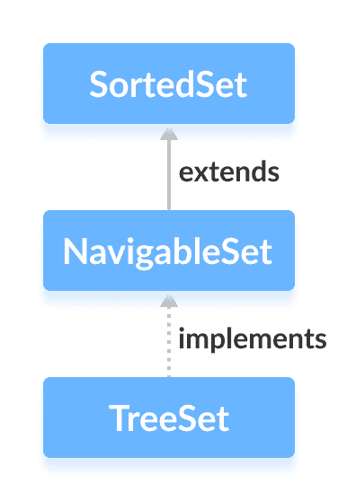

# Java `NavigableSet`接口

> 原文： [https://www.programiz.com/java-programming/navigableset](https://www.programiz.com/java-programming/navigableset)

#### 在本教程中，我们将通过一个示例来学习 Java `NavigableSet`接口及其方法。

Java 集合框架的`NavigableSet`接口提供了在设置的元素之间导航的功能。

它被视为 [SortedSet](/java-programming/sortedset "Java SortedSet Interface") 的类型。

* * *

## 实现`NavigableSet`的类

为了使用`NavigableSet`接口的功能，我们需要使用实现`NavigableSet`的`TreeSet`类。



* * *

## 如何使用`NavigableSet`？

在 Java 中，我们必须导入`java.util.NavigableSet`包才能使用`NavigableSet`。 导入包后，将按照以下方法创建可导航集。

```java
// SortedSet implementation by TreeSet class
NavigableSet<String> numbers = new TreeSet<>(); 
```

在这里，我们创建了一个名为`TreeSet`类的`number`的可导航集合。

* * *

## `NavigableSet`的方法

`NavigableSet`被认为是`SortedSet`的一种。 这是因为`NavigableSet`扩展了`SortedSet`接口。

因此，所有`SortedSet`方法在`NavigableSet`中也可用。 要了解这些方法的方式，请访问 [Java SortedSet](https://www.programiz.com/java-programming/sortedset) 。

但是，`SortedSet`中的某些方法（`headSet()`，`tailSet()`和`subSet()`）在`NavigableSet`中定义不同。

让我们看看如何在`NavigableSet`中定义这些方法。

* * *

### `headSet(element, booleanValue)`

`headSet()`方法返回指定`element`（作为参数传递）之前的可导航集合的所有元素。

`booleanValue`参数是可选的。 其默认值为`false`。

如果`true`作为`booleanValue`传递，则该方法返回指定元素之前的所有元素，包括指定元素。

* * *

### `tailSet(element, booleanValue)`

`tailSet()`方法返回包含指定元素的指定`element`（作为参数传递）之后的可导航集合的所有元素。

`booleanValue`参数是可选的。 其默认值为`true`。

如果将`false`作为`booleanValue`传递，则该方法返回指定元素之后的所有元素，但不包括指定元素。

* * *

### `subSet(e1, bv1, e2, bv2)`

`subSet()`方法返回`e1`和`e2`之间的所有元素，包括`e1`。

`bv1`和`bv2`是可选参数。`bv1`的默认值为`true`，`bv2`的默认值为`false`。

如果`false`作为`bv1`传递，则该方法返回`e1`和`e2`之间的所有元素，但不包括`e1`。

如果`true`作为`bv2`传递，则该方法返回`e1`和`e2`之间的所有元素，包括`e1`。

* * *

## 导航方法

`NavigableSet`提供了可用于导航其元素的各种方法。

*   **`endingSet()`** - 反转集合中元素的顺序
*   **`DescendingIterator()`** - 返回可用于以相反顺序迭代集合的迭代器
*   **`ceiling()`** - 返回大于或等于指定元素的那些元素中的最低元素
*   **`floor()`** - 返回小于或等于指定元素的那些元素中最大的元素
*   **`upper()`** - 返回大于指定元素的那些元素中的最低元素
*   **`lower()`** - 返回小于指定元素的那些元素中最大的元素
*   **`pollFirst()`** - 返回并从集合中删除第一个元素
*   **`pollLast()`** - 返回并从集合中删除最后一个元素

要了解有关`NavigableSet`的更多信息，请访问 [Java `NavigableSet`（Java 官方文档）](https://docs.oracle.com/javase/7/docs/api/java/util/NavigableSet.html)。

* * *

## `TreeSet`类中`NavigableSet`的实现

```java
import java.util.NavigableSet;
import java.util.TreeSet;

class Main {

    public static void main(String[] args) {
        // Creating NavigableSet using the TreeSet
        NavigableSet<Integer> numbers = new TreeSet<>();

        // Insert elements to the set
        numbers.add(1);
        numbers.add(2);
        numbers.add(3);
        System.out.println("NavigableSet: " + numbers);

        // Access the first element
        int firstElement = numbers.first();
        System.out.println("First Number: " + firstElement);

        // Access the last element
        int lastElement = numbers.last();
        System.out.println("Last Element: " + lastElement);

        // Remove the first element
        int number1 = numbers.pollFirst();
        System.out.println("Removed First Element: " + number1);

        // Remove the last element
        int number2 = numbers.pollLast();
        System.out.println("Removed Last Element: " + number2);

    }
} 
```

**输出**

```java
NavigableSet: [1, 2, 3]
First Element: 1
Last Element: 3
Removed First Element: 1
Removed Last Element: 3 
```

要了解有关`TreeSet`的更多信息，请访问 [Java TreeSet](/java-programming/treeset "Java TreeSet Class") 。

* * *

现在我们知道了`NavigableSet`接口，我们将使用`TreeSet`类学习其实现。