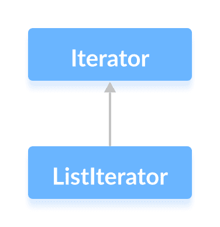

# Java 迭代器接口

> 原文： [https://www.programiz.com/java-programming/iterator](https://www.programiz.com/java-programming/iterator)

#### 在本教程中，我们将通过一个示例来学习 Java Iterator 接口。

Java 集合框架的`Iterator`接口允许我们访问集合的元素。 它具有子接口`ListIterator`。



所有 Java 集合均包含`iterator()`方法。 此方法返回用于迭代集合元素的迭代器实例。

* * *

## 迭代器的方法

`Iterator`接口提供了 4 种方法，可用于对集合元素执行各种操作。

*   `hasNext()`-如果集合中存在一个元素，则返回`true`
*   `next()`-返回集合的下一个元素
*   `remove()`-删除`next()`返回的最后一个元素
*   `forEachRemaining()`-对集合的每个剩余元素执行指定的操作

* * *

## 示例：迭代器的实现

在下面的示例中，我们在数组列表中实现了`Iterator`接口的`hasNext()`，`next(),` `remove()`和`forEachRemining()`方法。

```java
import java.util.ArrayList;
import java.util.Iterator;

class Main {
    public static void main(String[] args) {
        // Creating an ArrayList
        ArrayList<Integer> numbers = new ArrayList<>();
        numbers.add(1);
        numbers.add(3);
        numbers.add(2);
        System.out.println("ArrayList: " + numbers);

        // Creating an instance of Iterator
        Iterator<Integer> iterate = numbers.iterator();

        // Using the next() method
        int number = iterate.next();
        System.out.println("Accessed Element: " + number);

        // Using the remove() method
        iterate.remove();
        System.out.println("Removed Element: " + number);

        System.out.print("Updated ArrayList: ");

        // Using the hasNext() method
        while(iterate.hasNext()) {
            // Using the forEachRemaining() method
            iterate.forEachRemaining((value) -> System.out.print(value + ", "));
        }
    }
} 
```

**输出**

```java
ArrayList: [1, 3, 2]
Acessed Element: 1
Removed Element: 1
Updated ArrayList: 3, 2, 
```

在上面的示例中，请注意以下语句：

```java
iterate.forEachRemaining((value) -> System.put.print(value + ", ")); 
```

在这里，我们已将 [lambda 表达式](https://www.programiz.com/java-programming/lambda-expression)作为`forEachRemaining()`方法的参数传递。

现在，该方法将打印数组列表中的所有其余元素。