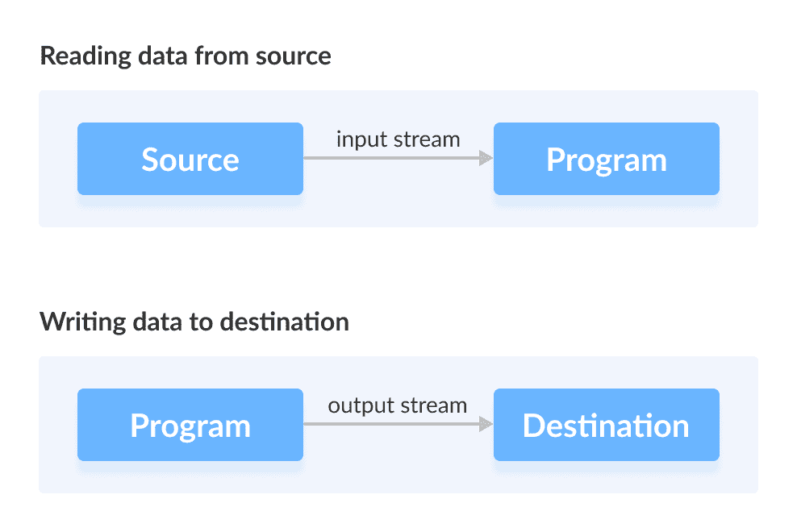

# Java I / O 流

> 原文： [https://www.programiz.com/java-programming/io-streams](https://www.programiz.com/java-programming/io-streams)

#### 在本教程中，我们将学习 Java 输入/输出流及其类型。

在 Java 中，流是从源读取并写入目的地的数据序列。

**输入流**用于从源读取数据。 并且，**输出流**用于将数据写入目的地。

```java
class HelloWorld {
    public static void main(String[] args) {
        System.out.println("Hello, World!"); 
    }
} 
```

例如，在我们的第一个 **Hello World** 示例中，我们使用了`System.out`打印字符串。 此处，`System.out`是一种输出流。

同样，也有输入流可以接受输入。



我们将在后面的教程中详细了解输入流和输出流。

* * *

## 流的类型

根据流包含的数据，可以将其分类为：

*   字节流
*   角色流

* * *

### 字节流

字节流用于读取和写入单个字节（8 位）的数据。

所有字节流类均从称为`InputStream`和`OutputStream`的基本抽象类派生。

要了解更多信息，请访问

*   [Java InputStream 类](/java-programming/inputstream "Java InputStream Class")
*   [Java OutputStream 类](/java-programming/outputstream "Java OutputStream Class")

* * *

### 角色流

字符流用于读取和写入单个数据字符。

所有字符流类均从基本抽象类`Reader`和`Writer`派生。

To learn more, visit

*   [Java 阅读器类](/java-programming/reader "Java Reader Class")
*   [Java Writer 类](/java-programming/writer "Java Writer Class")