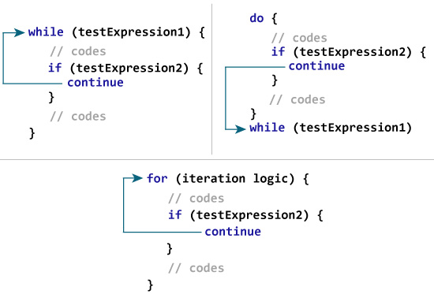
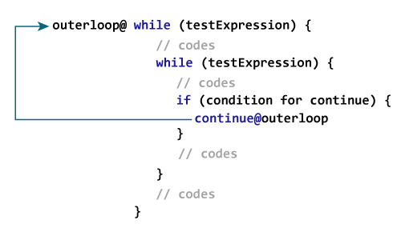

# Kotlin `continue`表达式

> 原文： [https://www.programiz.com/kotlin-programming/continue](https://www.programiz.com/kotlin-programming/continue)

#### 在本教程中，您将学习使用继续跳过循环的当前迭代。 另外，您还将在本文中了解有关继续标签的信息。

假设您正在使用循环。 有时希望跳过循环的当前迭代。

在这种情况下，将使用`continue`。`continue`构造跳过了当前的循环循环，并且程序控制跳到了循环主体的末尾。

* * *

## 继续如何进行？

如果...其他构造，它几乎总是与[一起使用。 例如，](/kotlin-programming/if-expression "Kotlin if...else")

```kt
while (testExpression1) {

    // codes1
    if (testExpression2) {
        continue
    }
    // codes2
}
```

如果将`testExpression2`求值为`true`，则将执行`continue`，在该迭代之后，它会跳过`while`循环内的所有代码。



* * *

### 示例：Kotlin `continue`

```kt
fun main(args: Array<String>) {

    for (i in 1..5) {
        println("$i Always printed.")
        if (i > 1 && i < 5) {
            continue
        }
        println("$i Not always printed.")
    }
}
```

运行该程序时，输出为：

```kt
1 Always printed.
1 Not always printed.
2 Always printed.
3 Always printed.
4 Always printed.
5 Always printed.
5 Not always printed.
```

当`i`的值大于 1 且小于 5 时，将执行`continue`，从而跳过执行

```kt
println("$i Not always printed.")
```

声明。

但是，声明

```kt
println("$i Always printed.")
```

在此循环的每次迭代中都执行此语句，因为此语句位于`continue`构造之前。

* * *

### 示例：仅计算正数之和

下面的程序计算用户输入的最多 6 个正数的总和。 如果用户输入负数或零，则将其从计算中跳过。

访问 [Kotlin 基本输入输出](https://www.programiz.com/kotlin-programming/input-output)，以了解有关如何从用户那里获取输入的更多信息。

```kt
fun main(args: Array<String>) {

    var number: Int
    var sum = 0

    for (i in 1..6) {
        print("Enter an integer: ")
        number = readLine()!!.toInt()

        if (number <= 0)
            continue

        sum += number
    }
    println("sum = $sum")
}
```

When you run the program, the output will be:

```kt
Enter an integer: 4
Enter an integer: 5
Enter an integer: -50
Enter an integer: 10
Enter an integer: 0
Enter an integer: 12
sum = 31
```

* * *

## Kotlin `continue`标签

到目前为止，您所学到的是`continue`的未标记形式，它跳过了最近的封闭循环的当前迭代。 通过使用`continue`标签，`continue`也可用于跳过所需循环（可以是外部循环）的迭代。

* * *

### `continue`标签如何工作



Kotlin 中的标签以[标识符](https://www.programiz.com/kotlin-programming/keywords-identifiers#identifiers "Kotlin identifier")开头，后跟`@`。

在此，`outsideloop @`是在循环时在外部[处标记的标签。 现在，通过在标签上使用`continue`（在这种情况下为`continue@outerloop`），可以跳过该迭代的特定循环代码的执行。](https://www.programiz.com/kotlin-programming/while-loop "Kotlin while Loop")

* * *

### 示例：标记为继续

```kt
fun main(args: Array<String>) {

    here@ for (i in 1..5) {
        for (j in 1..4) {
            if (i == 3 || j == 2)
                continue@here
            println("i = $i; j = $j")
        }
    }
}
```

When you run the program, the output will be:

```kt
i = 1; j = 1
i = 2; j = 1
i = 4; j = 1
i = 5; j = 1

```

通常不建议使用标记为`continue`的代码，因为这会使您的代码难以理解。 如果您必须使用标记为`continue`的情况，请重构代码并尝试以其他方式解决它，以使其更具可读性。

* * *

Kotlin 中有 3 个结构跳转表达式：`break`，`continue`和`return`。 要了解`break`和`return`表达，请访问：

*   *Kotlin `break`*
*   *Kotlin 函数*