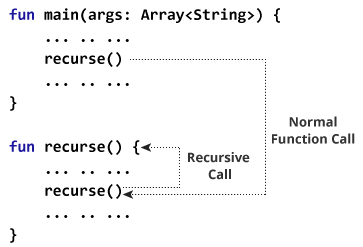
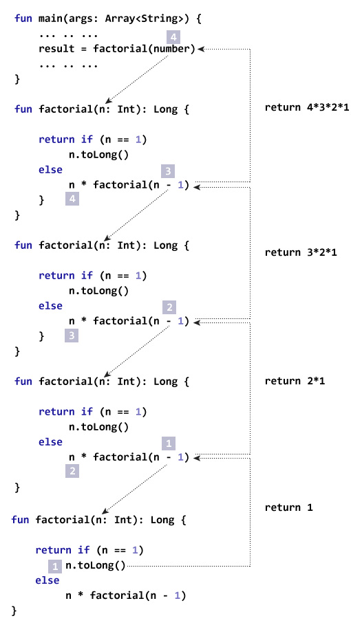

# Kotlin 递归（递归函数）和尾递归

> 原文： [https://www.programiz.com/kotlin-programming/recursion](https://www.programiz.com/kotlin-programming/recursion)

#### 在本文中，您将学习创建递归函数。 一个自我调用的函数。 此外，您还将了解尾递归函数。

调用自身的[函数](/kotlin-programming/functions)被称为递归函数。 并且，这种技术称为递归。

一个物理世界的例子是放置两个相互面对的平行反射镜。 它们之间的任何对象都将递归地反映出来。

* * *

### 递归在编程中如何工作？

```kt
fun main(args: Array<String>) {
    ... .. ...
    recurse()
    ... .. ...
}

fun recurse() {
    ... .. ...
    recurse()
    ... .. ...
}

```

在此，从`recurse()`函数本身的主体调用`recurse()`函数。 该程序的工作原理如下：



在这里，递归调用将永远持续下去，从而导致无限递归。

为了避免无限递归，可以在一个分支进行递归调用而另一分支不递归的情况下使用 [if...else](/kotlin-programming/if-expression "C++ if...else") （或类似方法）。

* * *

### 示例：使用递归查找数字的阶乘

```kt
fun main(args: Array<String>) {
    val number = 4
    val result: Long

    result = factorial(number)
    println("Factorial of $number = $result")
}

fun factorial(n: Int): Long {
    return if (n == 1) n.toLong() else n*factorial(n-1)
}
```

运行该程序时，输出为：

```kt
Factorial of 4 = 24
```

* * *

### 该程序如何工作？

下图说明了`factorial()`函数的递归调用：



涉及的步骤如下：

```kt
factorial(4)              // 1st function call. Argument: 4
4*factorial(3)            // 2nd function call. Argument: 3
4*(3*factorial(2))        // 3rd function call. Argument: 2
4*(3*(2*factorial(1)))    // 4th function call. Argument: 1 
4*(3*(2*1))                 
24

```

* * *

### Kotlin 尾递归

尾递归是一个通用概念，而不是 Kotlin 语言的功能。 包括 Kotlin 在内的某些编程语言使用它来优化递归调用，而其他语言（例如 Python）不支持它们。

* * *

### 什么是尾递归？

在普通递归中，首先执行所有递归调用，最后从返回值计算结果（如上例所示）。 因此，在进行所有递归调用之前，您不会得到结果。

在尾部递归中，首先执行计算，然后执行递归调用（递归调用将当前步骤的结果传递到下一个递归调用）。 这使得递归调用等效于循环，并避免了堆栈溢出的风险。

* * *

### 尾递归的条件

如果对自身的函数调用是它执行的最后一个操作，则该递归函数可以进行尾部递归。 例如，

**示例 1**：不适合进行尾递归，因为对自身`n*factorial(n-1)`的函数调用不是最后的操作。

```kt
fun factorial(n: Int): Long {

    if (n == 1) {
        return n.toLong()
    } else {
        return n*factorial(n - 1)     
    }
}
```

**示例 2**：有资格进行尾递归，因为对自身`fibonacci(n-1, a+b, a)`的函数调用是最后的操作。

```kt
fun fibonacci(n: Int, a: Long, b: Long): Long {
    return if (n == 0) b else fibonacci(n-1, a+b, a)
}

```

* * *

要告诉编译器在 Kotlin 中执行尾部递归，您需要使用`tailrec`修饰符标记该函数。

* * *

### 示例：尾递归

```kt
import java.math.BigInteger

fun main(args: Array<String>) {
    val n = 100
    val first = BigInteger("0")
    val second = BigInteger("1")

    println(fibonacci(n, first, second))
}

tailrec fun fibonacci(n: Int, a: BigInteger, b: BigInteger): BigInteger {
    return if (n == 0) a else fibonacci(n-1, b, a+b)
}
```

When you run the program, the output will be:

```kt
354224848179261915075
```

该程序计算斐波那契数列的第 100 项。 由于输出可能是非常大的整数，因此我们从 Java 标准库中导入了 [BigInteger](https://docs.oracle.com/javase/7/docs/api/java/math/BigInteger.html) 类。

此处，函数`fibonacci()`用`tailrec`修饰符标记，并且该函数可进行尾递归调用。 因此，在这种情况下，编译器会优化递归。

* * *

如果尝试在不使用尾部递归的情况下找到斐波那契序列的第 20000 项（或任何其他大整数），则编译器将引发`java.lang.StackOverflowError`异常。 但是，我们上面的程序可以正常工作。 这是因为我们使用了尾部递归，它使用了基于循环的高效版本，而不是传统的递归。

* * *

### 示例：使用尾递归的阶乘

上述示例（第一个示例）中用于计算数字阶乘的示例无法针对尾递归进行优化。 这是执行相同任务的另一个程序。

```kt
fun main(args: Array<String>) {
    val number = 5
    println("Factorial of $number = ${factorial(number)}")
}

tailrec fun factorial(n: Int, run: Int = 1): Long {
    return if (n == 1) run.toLong() else factorial(n-1, run*n)
}

```

When you run the program, the output will be:

```kt
Factorial of 5 = 120
```

编译器可以在此程序中优化递归，因为递归函数可以进行尾递归，并且我们使用了`tailrec`修饰符，告诉编译器优化递归。