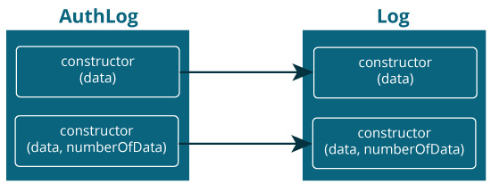
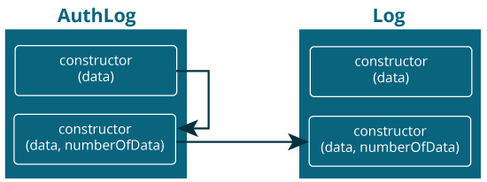

# Kotlin 构造器

> 原文： [https://www.programiz.com/kotlin-programming/constructors](https://www.programiz.com/kotlin-programming/constructors)

#### 在本文中，您将通过示例了解 Kotlin 中的构造器（主要构造器和辅助构造器）以及初始化块。

构造器是初始化类属性的简洁方法。

它是一个特殊的成员函数，在实例化（创建）对象时调用。 但是，它们在 Kotlin 中的工作方式略有不同。

在 Kotlin 中，有两个构造器：

*   **主要构造器** - 初始化类的简洁方法
*   **辅助构造器** - 允许您放置其他初始化逻辑

* * *

## 主要构造器

主构造器是类标头的一部分。 这是一个例子：

```kt
class Person(val firstName: String, var age: Int) {
    // class body
}
```

用括号括起来的代码块是主要的构造器：`(val firstName: String, var age: Int)`。

构造器声明了两个属性：`firstName`（使用关键字`val`声明的只读属性）和`age`（使用关键字`var`声明的读写属性）。

* * *

### 示例：主要构造器

```kt
fun main(args: Array<String>) {

    val person1 = Person("Joe", 25)

    println("First Name = ${person1.firstName}")
    println("Age = ${person1.age}")
}

class Person(val firstName: String, var age: Int) {

}
```

运行该程序时，输出为：

```kt
First Name = Joe
Age = 25
```

创建`Person`类的对象时，就像`Person`是一个函数一样，传递`"Joe"`和`25`值。

这会将`person1`对象的`firstName`和`age`属性分别初始化为`"Joe"`和`25`。

* * *

还有其他使用主要构造器的方法。

* * *

### 主构造器和初始化器块

主构造器的语法受约束，不能包含任何代码。

为了放置初始化代码（不仅是用于初始化属性的代码），使用了初始化块。 它以`init`关键字为前缀。 让我们使用初始化块修改以上示例：

```kt
fun main(args: Array<String>) {
    val person1 = Person("joe", 25)
}

class Person(fName: String, personAge: Int) {
    val firstName: String
    var age: Int

    // initializer block
    init {
        firstName = fName.capitalize()
        age = personAge

        println("First Name = $firstName")
        println("Age = $age")
    }
}
```

When you run the program, the output will be:

```kt
First Name = Joe
Age = 25
```

在此，当创建`person1`对象时，括号内的参数`fName`和`personAge`分别接受值`"Joe"`和`25`。 但是，不使用`var`或`val`而使用`fName`和`personAge`，它们不是`Person`类的属性。

`Person`类具有两个属性`firstName`，并且声明了`age`。

创建`person1`对象时，将执行初始化块内的代码。 初始化块不仅初始化其属性，还打印它们。

* * *

这是执行相同任务的另一种方法：

```kt
fun main(args: Array<String>) {
    val person1 = Person("joe", 25)
}

class Person(fName: String, personAge: Int) {
    val firstName = fName.capitalize()
    var age = personAge

    // initializer block
    init {
        println("First Name = $firstName")
        println("Age = $age")
    }
}
```

* * *

为了区分构造器参数和属性，使用了不同的名称（`fName`和`firstName`，以及`personAge`和`age`）。 对于构造器参数，使用`_firstName`和`_age`更为常见。 例如：

```kt
class Person(_firstName: String, _age: Int) {
    val firstName = _firstName.capitalize()
    var age = _age

    // initializer block
    init {
        ... .. ...
    }
}

```

* * *

### 主构造器中的默认值

您可以为构造器参数提供默认值（类似于为函数提供[默认参数）。 例如：](https://www.programiz.com/kotlin-programming/default-named-arguments)

```kt
fun main(args: Array<String>) {

    println("person1 is instantiated")
    val person1 = Person("joe", 25)

    println("person2 is instantiated")
    val person2 = Person("Jack")

    println("person3 is instantiated")
    val person3 = Person()
}

class Person(_firstName: String = "UNKNOWN", _age: Int = 0) {
    val firstName = _firstName.capitalize()
    var age = _age

    // initializer block
    init {
        println("First Name = $firstName")
        println("Age = $age\n")
    }
}
```

When you run the program, the output will be:

```kt
First Name = Joe
Age = 25

person2 is instantiated
First Name = Jack
Age = 0

person3 is instantiated
First Name = UNKNOWN
Age = 0
```

* * *

## Kotlin 二级构造器

在 Kotlin 中，一个类还可以包含一个或多个辅助构造器。 它们是使用`constructor`关键字创建的。

二级构造器在 Kotlin 中并不常见。 当您需要扩展一个提供多个以不同方式初始化该类的构造器的类时，就会出现辅助构造器的最常见用法。 在学习之前，请务必检查 [Kotlin 继承](/kotlin-programming/inheritance "Kotlin Inheritance")。

这是您可以在 Kotlin 中创建辅助构造器的方法：

```kt
class Log {
    constructor(data: String) {
        // some code
    }
    constructor(data: String, numberOfData: Int) {
        // some code
    }
}
```

此处，`Log`类具有两个辅助构造器，但没有主要构造器。

您可以将类扩展为：

```kt
class Log {
    constructor(data: String) {
        // code
    }
    constructor(data: String, numberOfData: Int) {
        // code
    }
}

class AuthLog: Log {
    constructor(data: String): super(data) {
        // code
    }
    constructor(data: String, numberOfData: Int): super(data, numberOfData) {
        // code
    }
}
```

在此，派生类`AuthLog`的构造器调用基类`Log`的相应构造器。 为此，使用`super()`。



在 Kotlin 中，您还可以使用`this()`从相同类的另一个构造器（如 Java 中）调用构造器。

```kt
class AuthLog: Log {
    constructor(data: String): this(data, 10) {
        // code
    }
    constructor(data: String, numberOfData: Int): super(data, numberOfData) {
        // code
    }
}

```



* * *

### 示例：Kotlin 二级构造器

```kt
fun main(args: Array<String>) {

    val p1 = AuthLog("Bad Password")
}

open class Log {
    var data: String = ""
    var numberOfData = 0
    constructor(_data: String) {

    }
    constructor(_data: String, _numberOfData: Int) {
        data = _data
        numberOfData = _numberOfData
        println("$data: $numberOfData times")
    }
}

class AuthLog: Log {
    constructor(_data: String): this("From AuthLog -> " + _data, 10) {
    }

    constructor(_data: String, _numberOfData: Int): super(_data, _numberOfData) {
    }
}
```

When you run the program, the output will be:

```kt
From AuthLog -> Bad Password: 10 times
```

**注意**：如果该类没有主构造器，则辅助构造器必须初始化基类或委托给另一个构造器（如上例所示）。