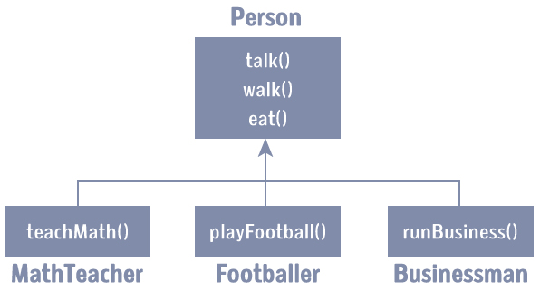

# Kotlin 继承

> 原文： [https://www.programiz.com/kotlin-programming/inheritance](https://www.programiz.com/kotlin-programming/inheritance)

#### 在本文中，您将学习继承。 更具体地说，什么是继承以及如何在 Kotlin 中实现继承（借助示例）。

继承是面向对象编程的主要功能之一。 它允许用户从现有类（基类）创建一个新类（派生类）。

派生类继承了基类的所有功能，并且可以拥有自己的其他功能。

在详细介绍 Kotlin 继承之前，建议您阅读以下两篇文章：

*   [Kotlin 类和对象](/kotlin-programming/class-objects "Kotlin OOP")
*   [Kotlin 主要构造器](/kotlin-programming/constructors#primary " Kotlin Constructors and Initializers")

* * *

## 为什么是继承？

假设在您的应用中，您需要三个字符-一个**数学老师**，一个**足球运动员**和一个**商人**。

由于所有角色都是人，因此他们可以走路和说话。 但是，他们也有一些特殊技能。 数学老师可以**教数学**，足球运动员可以**踢足球**，商人可以**经营业务**。

您可以单独创建三个可以走路，说话和执行其特殊技能的课程。


在每个类中，您将为每个角色复制相同的步行和说话代码。

如果要添加新功能`eat`，则需要为每个字符实现相同的代码。 这很容易导致出错（复制时）和重复代码。

如果我们有一个`Person`类，它具有基本的功能，例如说话，走路，吃饭，睡觉，并根据我们的角色向这些功能添加特殊技能，那就容易得多。 这是使用继承完成的。



使用继承，现在您不必为每个类的`walk()`，`talk()`和`eat()`实现相同的代码。 您只需要**继承它们**。

因此，对于`MathTeacher`（派生类），您可以继承`Person`（基类）的所有功能并添加新功能`teachMath()`。 同样，对于`Footballer`类，您可以继承`Person`类的所有功能，并添加新功能`playFootball()`，依此类推。

这使您的代码更简洁，易于理解和可扩展。

**重要的是要记住**：在处理继承时，每个派生类都应满足“**是**”基类的条件。 在以上示例中，`MathTeacher`**是**`Person`，`Footballer`**是**`Person`。 您不能有`Businessman`**是**`Business`这类的东西。

* * *

## Kotlin 继承

让我们尝试在代码中实现以上讨论：

```kt
open class Person(age: Int) {
    // code for eating, talking, walking
}

class MathTeacher(age: Int): Person(age) {
    // other features of math teacher
}

class Footballer(age: Int): Person(age) {
    // other features of footballer
}

class Businessman(age: Int): Person(age) {
    // other features of businessman
}
```

在此，`Person`是基类，并且`MathTeacher`，`Footballer`和`Businessman`类是从`Person`类派生的。

注意，在基类`Person`之前的关键字`open`。 这一点很重要。

默认情况下，Kotlin 中的类是最终的。 如果您熟悉 Java，那么您将知道最终类不能被子类化。 通过在类上使用开放注释，编译器允许您从其派生新类。

* * *

## 示例：Kotlin 继承

```kt
open class Person(age: Int, name: String) {
    init {
        println("My name is $name.")
        println("My age is $age")
    }
}

class MathTeacher(age: Int, name: String): Person(age, name) {

    fun teachMaths() {
        println("I teach in primary school.")
    }
}

class Footballer(age: Int, name: String): Person(age, name) {
    fun playFootball() {
        println("I play for LA Galaxy.")
    }
}

fun main(args: Array<String>) {
    val t1 = MathTeacher(25, "Jack")
    t1.teachMaths()

    println()

    val f1 = Footballer(29, "Christiano")
    f1.playFootball()
}
```

运行该程序时，输出为：

```kt
My name is Jack.
My age is 25
I teach in primary school.

My name is Cristiano.
My age is 29
I play for LA Galaxy.
```

这里，从`Person`类派生两个类`MathTeacher`和`Footballer`。

`Person`类的主要构造器声明了两个属性：`age`和`name`，并且它具有一个初始化块。 基类`Person`的初始化块（和成员函数）可以由派生类（`MathTeacher`和`Footballer`）的对象访问。

派生类`MathTeacher`和`Footballer`分别具有自己的成员函数`teachMaths()`和`playFootball()`。 这些功能只能从其各自类别的对象中访问。

* * *

创建`MathTeacher`类的对象`t1`时，

```kt
val t1 = MathTeacher(25, "Jack")
```

参数被传递给主构造器。 在 Kotlin 中，创建对象时会调用`init`块。 由于`MathTeacher`是从`Person`类派生的，因此它将在基类（`Person`）中查找初始化块并执行它。 如果`MathTeacher`具有初始化块，则编译器还将执行派生类的初始化块。

接下来，使用`t1.teachMaths()`语句调用对象`t1`的`teachMaths()`函数。

创建`Footballer`类的对象`f1`时，程序的工作原理类似。 它执行基类的 init 块。 然后，使用语句`f1.playFootball()`调用`Footballer`类的`playFootball()`方法。

* * *

## 重要说明：Kotlin 继承

*   如果类具有主要构造器，则必须使用主要构造器的参数来初始化基类。 在上面的程序中，两个派生类都有两个参数`age`和`name`，并且这两个参数都在基类的主构造器中初始化。

    这是另一个示例：

    ```kt
    open class Person(age: Int, name: String) {
        // some code
    }

    class Footballer(age: Int, name: String, club: String): Person(age, name) {
        init {
            println("Football player $name of age $age and plays for $club.")
        }

        fun playFootball() {
            println("I am playing football.")
        }
    }

    fun main(args: Array<String>) {
        val f1 = Footballer(29, "Cristiano", "LA Galaxy")
    } 

    ```

    在此，派生类的主要构造器具有 3 个参数，而基类具有 2 个参数。 请注意，基类的两个参数均已初始化。

*   在没有主构造器的情况下，每个基类都必须初始化基函数（使用`super`关键字），或者委托给另一个执行该操作的构造器。 例如，

    ```kt
    fun main(args: Array<String>) {

        val p1 = AuthLog("Bad Password")
    }

    open class Log {
        var data: String = ""
        var numberOfData = 0
        constructor(_data: String) {

        }
        constructor(_data: String, _numberOfData: Int) {
            data = _data
            numberOfData = _numberOfData
            println("$data: $numberOfData times")
        }
    }

    class AuthLog: Log {
        constructor(_data: String): this("From AuthLog -> + $_data", 10) {
        }

        constructor(_data: String, _numberOfData: Int): super(_data, _numberOfData) {
        }
    }
    ```

    要了解有关该程序如何工作的更多信息，请访问 [Kotlin 二级构造器](/kotlin-programming/constructors#secondary "Kotlin Secondary Constructor")。

* * *

## 覆盖成员的函数和属性

如果基类和派生类包含名称相同的成员函数（或属性），则可能需要使用`override`关键字覆盖派生类的成员函数，并对基类使用`open`关键字。

* * *

## 示例：覆盖成员函数

```kt
// Empty primary constructor
open class Person() {
    open fun displayAge(age: Int) {
        println("My age is $age.")
    }
}

class Girl: Person() {

    override fun displayAge(age: Int) {
        println("My fake age is ${age - 5}.")
    }
}

fun main(args: Array<String>) {
    val girl = Girl()
    girl.displayAge(31)
}
```

运行该程序时，输出为：

```kt
My fake age is 26.
```

在此，`girl.displayAge(31)`调用派生类`Girl`的`displayAge()`方法。

* * *

您可以通过类似的方式覆盖基类的属性。

在检查以下示例之前，请访问 [Kotlin 获取器和设置器](/kotlin-programming/getters-setters "Kotlin getters and setters")在 Kotlin 中的工作方式。

```kt
// Empty primary constructor
open class Person() {
    open var age: Int = 0
        get() = field

        set(value) {
            field = value
        }
}

class Girl: Person() {

    override var age: Int = 0
        get() = field

        set(value) {
            field = value - 5
        }
}

fun main(args: Array<String>) {

    val girl = Girl()
    girl.age = 31
    println("My fake age is ${girl.age}.")
}
```

运行该程序时，输出为：

```kt
My fake age is 26.
```

如您所见，我们分别在派生类和基类中为`age`属性使用了`override`和`open`关键字。

* * *

### 从派生类调用基类成员

您可以使用`super`关键字从派生类中调用基类的函数（和访问属性）。 这是如何做：

```kt
open class Person() {
    open fun displayAge(age: Int) {
        println("My actual age is $age.")
    }
}

class Girl: Person() {

    override fun displayAge(age: Int) {

        // calling function of base class
        super.displayAge(age)

        println("My fake age is ${age - 5}.")
    }
}

fun main(args: Array<String>) {
    val girl = Girl()
    girl.displayAge(31)
}
```

运行该程序时，输出为：

```kt
My age is 31.
My fake age is 26.
```