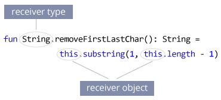

# Kotlin 扩展函数

> 原文： [https://www.programiz.com/kotlin-programming/extension-functions](https://www.programiz.com/kotlin-programming/extension-functions)

#### 在本文中，您将学习使用扩展函数使用新功能扩展类。

假设您需要扩展具有新功能的类。 在大多数编程语言中，您可以[派生新的类](/kotlin-programming/inheritance "Kotlin Inheritance")或使用某种设计模式来执行此操作。

但是，在 Koltin 中，您还可以使用扩展功能来扩展具有新功能的类。 基本上，扩展函数是在类外部定义的类的成员函数。

例如，您需要对[字符串类](/kotlin-programming/string "Kotlin String Class")使用一个方法，该方法返回删除了第一个和最后一个字符的新字符串。`String`类中尚未提供此方法。 您可以使用扩展功能来完成此任务。

* * *

### 示例：删除字符串的第一个和最后一个字符

```kt
fun String.removeFirstLastChar(): String =  this.substring(1, this.length - 1)

fun main(args: Array<String>) {
    val myString= "Hello Everyone"
    val result = myString.removeFirstLastChar()
    println("First character is: $result")
}
```

运行该程序时，输出为：

```kt
First character is: ello Everyon
```

在这里，扩展函数`removeFirstLastChar()`被添加到`String`类。

类名是接收者类型（在我们的示例中为`String`类）。 扩展功能内的`this`关键字引用接收者对象。



* * *

如果需要将 Kotlin 集成到 Java 项目的顶部，则无需将整个代码修改为 Koltin。 只需使用扩展功能即可添加函数。

话虽如此，很容易滥用扩展功能的力量。 我们建议您检查这些资源，以了解何时使用扩展程序以及何时不使用扩展程序：

*   [扩展方法和扩展属性是否不好？](https://stackoverflow.com/questions/40598131/are-extension-methods-and-extension-properties-are-bad-practice)
*   [如何滥用 Kotlin 扩展功能？](https://www.philosophicalhacker.com/post/how-to-abuse-kotlin-extension-functions/)