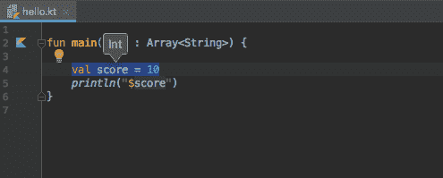

# Kotlin 变量和基本类型

> 原文： [https://www.programiz.com/kotlin-programming/variable-types](https://www.programiz.com/kotlin-programming/variable-types)

#### 在本教程中，您将了解变量，如何创建变量以及 Kotlin 支持创建变量的基本数据类型。

如您所知，变量是内存中用于存储数据的位置（存储区域）。

为了指示存储区域，应该为每个变量赋予唯一的名称（标识符）。 了解更多有关[如何在 Kotlin 中命名变量的信息？](/kotlin-programming/keywords-identifiers "Java Keywords and Identifiers")

* * *

### 如何在 Kotlin 中声明变量？

要在 Kotlin 中声明变量，请使用`var`或`val`关键字。 这是一个例子：

```kt
var language = "French"
val score = 95
```

本文稍后将讨论使用 `var` 和 `val` 的区别。 现在，让我们集中讨论变量声明。

在此，`语言`是类型`String`的变量，`score`是类型`Int`的变量。 您不必指定变量的类型。 Kotlin 暗中为您执行此操作。 编译器通过初始化表达式来知道这一点（在上述程序中，`“法语”` 是`String`， `95` 是整数）。 这在编程中称为类型推断。

但是，如果要执行以下操作，则可以显式指定类型：

```kt
var language: String = "French"
val score: Int = 95
```

在上面的示例中，我们在声明过程中初始化了变量。 但是，这不是必需的。 您可以在一个语句中声明变量并指定其类型，然后稍后在程序中在另一条语句中初始化变量。

```kt
var language: String      // variable declaration of type String
... .. ...
language = "French"       // variable initialization

val score: Int          // variable declaration of type Int 
... .. ...
score = 95             // variable initialization 
```

* * *

以下是一些导致错误的示例。

```kt
var language           // Error 
language = "French"
```

在此，未明确指定`语言`变量的类型，也未在声明期间初始化该变量。

```kt
var language: String
language = 14         // Error
```

此处，我们试图将 14（整数值）分配给不同类型的变量（`String`）。

* * *

### var 和 val 之间的区别

*   **val** （不可变参考）-一旦分配了值，就无法更改使用`val`关键字声明的变量。 它类似于 Java 中的*最终变量。*
*   **var** （可变参考）-使用`var`关键字声明的变量可以稍后在程序中更改。 它对应于常规 Java 变量。

以下是一些示例：

```kt
var language = "French"
language = "German"     
```

在此，`language`变量被重新分配给`德语`。 由于该变量是使用`var`声明的，因此此代码可以完美运行。

```kt
val language = "French"
language = "German"      // Error
```

在上面的示例中，您无法将`语言`变量重新分配给`German`，因为该变量是使用`val`声明的。

* * *

现在，您知道什么是 Kotlin 变量，是时候学习 Kotlin 变量可以采用的不同值了。

* * *

## Kotlin 基本类型

Kotlin 是一种类似于 Java 的静态类型语言。 也就是说，在编译期间，变量的类型是已知的。 例如，

```kt
val language: Int
val marks = 12.3
```

在此，编译器在编译时间之前就知道`语言`是`Int`类型的，而`标志`是`Double`类型的。

Kotlin 中的内置类型可以分类为：

*   号码
*   性格
*   布尔值
*   数组

### 编号类型

* * *

Kotlin 中的数字类似于 Java。 有 6 种内置类型代表数字。

*   字节
*   短
*   整数
*   Long
*   浮动
*   双

#### 1.字节

* * *

*   `Byte`数据类型的值可以从-128 到 127（8 位带符号二进制补码整数）。
*   如果可以确定某个变量的值在[-128，127]之内，则可以使用它代替`Int`或其他整数数据类型来节省内存
*   范例：

    ```kt
    fun main(args : Array<String>) {
        val range: Byte = 112
        println("$range")

        // The code below gives error. Why?
        // val range1: Byte = 200
    }
    ```

运行该程序时，输出为：

```kt
112
```

#### 2.短路

* * *

*   `Short`数据类型的值可以从-32768 到 32767（16 位带符号二进制补码整数）。
*   如果可以确定该变量的值在[-32768，32767]之内，则可以使用它代替其他整数数据类型来节省内存。
*   例：

```kt
fun main(args : Array<String>) {

    val temperature: Short = -11245
    println("$temperature")
}
```

When you run the program, the output will be:

```kt
-11245
```

#### 3.整数

* * *

*   `Int`数据类型的值可以从`-2<sup>31</sup>`到`2<sup>31</sup>-1`（32 位带符号的二进制补码整数）。
*   例：

```kt
fun main(args : Array<String>) {

    val score: Int =  100000
    println("$score")
}
```

When you run the program, the output will be:

```kt
100000
```

如果您在`-2<sup>31</sup>`至`2<sup>31</sup>-1`之间分配一个整数而未明确指定其类型，则该变量将为`Int`类型。 例如，

```kt
fun main(args : Array<String>) {

   // score is of type Int
    val score = 10
    println("$score")
}

```

如果使用的是 IntelliJ IDEA，则可以将光标放在变量内，然后按`Ctrl + Shift + P`查看其类型。


#### 4.长

* * *

*   `Long`数据类型的值可以从`-2<sup>63</sup>`到`2<sup>63</sup>-1`（64 位带符号二进制补码整数）。
*   例：

```kt
fun main(args : Array<String>) {

    val highestScore: Long = 9999
    println("$highestScore")
}
```

When you run the program, the output will be:

```kt
9999
```

如果为变量分配一个大于`2<sup>31</sup>-1`或小于`-2<sup>31</sup>`的整数值（未明确指定其类型），则该变量将为`Long`类型。 例如，

```kt
val distance = 10000000000  // distance variable of type Long

```

同样，您可以使用大写字母 `L` 来指定变量为`Long`类型。 例如，

```kt
val distance = 100L    // distance value of type Long
```

#### 5.双

* * *

*   `Double`类型是双精度 64 位浮点。
*   例：

```kt
fun main(args : Array<String>) {

    // distance is of type Double
    val distance = 999.5
    println("$distance")
}

```

When you run the program, the output will be:

```kt
999.5
```

#### 浮动

* * *

*   `Float`数据类型是单精度 32 位浮点。 如果您有兴趣，请进一步了解[单精度和双精度浮点](http://stackoverflow.com/questions/801117/whats-the-difference-between-a-single-precision-and-double-precision-floating-p)。
*   例：

```kt
fun main(args : Array<String>) {

    // distance is of type Float
    val distance = 19.5F
    println("$distance")
}

```

When you run the program, the output will be:

```kt
19.5
```

请注意，我们在上述程序中使用了`<font face="monospace">19.5F</font>`而不是`19.5`。 这是因为`19.5`是`Double`文字，并且您无法将`Double`值分配给`Float`类型的变量。

要告诉编译器将`19.5`视为`Float`，您需要最后使用 `F` 。

* * *

如果不确定在程序中将分配哪个数字值，可以将其指定为`Number`类型。 这使您既可以将整数值又可以将浮点值分配给变量（一次分配一个）。 例如：

```kt
fun main(args : Array<String>) {

    var test: Number = 12.2
    println("$test")

    test = 12
    // Int smart cast from Number
    println("$test")

    test = 120L
    // Long smart cast from Number
    println("$test")
}

```

When you run the program, the output will be:

```kt
12.2
12
120
```

要了解更多信息，请访问： *Kotlin Smart Casts*

* * *

#### 字符

为了表示 Kotlin 中的字符，使用了 `Char` 类型。

与 Java 不同，`字符`类型不能视为数字。 访问此页面以了解有关 [Java char 类型](/java-programming/variables-primitive-data-types#char)的更多信息。

```kt
fun main(args : Array<String>) {

    val letter: Char
    letter = 'k'
    println("$letter")
}

```

When you run the program, the output will be:

```kt
k

```

在 Java 中，您可以执行以下操作：

```kt
char letter = 65;
```

但是，以下代码在 Kotlin 中给出了错误。

```kt
var letter: Char = 65  // Error
```

* * *

#### 布尔值

*   `Boolean`数据类型有两个可能的值，即`true`或`false`。
*   例：

```kt
fun main(args : Array<String>) {

    val flag = true
    println("$flag")
}
```

布尔值用于决策语句（将在下一章中讨论）。

* * *

## Kotlin 阵列

数组是一个容器，其中包含一种类型的数据（值）。 例如，您可以创建一个可以容纳 100 个`Int`类型值的数组。

在 Kotlin 中，数组由`Array`类表示。 该类具有`get`和`set`函数，`size`属性以及其他一些有用的成员函数。

要详细了解数组，请访问： *Kotlin 数组*

* * *

## 科特林弦

在 Kotlin 中，字符串由`String`类表示。 诸如`“这是一个字符串”` 之类的字符串文字被实现为此类的实例。

要详细了解字符串，请访问： *Kotlin 字符串*

* * *

### 推荐读物

*   *Kotlin 中的类型转换*
*   *Kotlin 中的聪明演员表*
*   *Kotlin 可为空的类型*