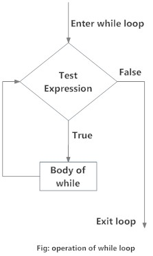

# Python `While`循环

> 原文： [https://www.programiz.com/python-programming/while-loop](https://www.programiz.com/python-programming/while-loop)

#### 循环在编程中用于重复特定的代码块。 在本文中，您将学习在 Python 中创建`while`循环。

## 什么是 Python 中的`while`循环？

只要测试表达式（条件）为真，Python 中的`while`循环就可以迭代代码块。

当我们不知道事先进行迭代的次数时，通常使用此循环。

### Python 中`while`循环的语法

```py
while test_expression:
    Body of while
```

在`while`循环中，首先检查测试表达式。 仅当`test_expression`求值为`True`时，才进入循环的主体。 一次迭代后，再次检查测试表达式。 该过程一直持续到`test_expression`求值为`False`为止。

在 Python 中，`while`循环的主体是通过缩进确定的。

主体以缩进开始，第一条未缩进的线标记结束。

Python 将任何非零值解释为`True`。`None`和`0`解释为`False`。

### `While`循环流程图



Flowchart for while loop in Python


### 示例：Python `while`循环

```py
# Program to add natural
# numbers up to 
# sum = 1+2+3+...+n

# To take input from the user,
# n = int(input("Enter n: "))

n = 10

# initialize sum and counter
sum = 0
i = 1

while i <= n:
    sum = sum + i
    i = i+1    # update counter

# print the sum
print("The sum is", sum)
```

运行该程序时，输出为：

```py
Enter n: 10
The sum is 55
```

在上述程序中，只要我们的计数器变量`i`小于或等于`n`（在我们的程序中为 10），则测试表达式为`True`。

我们需要在循环体内增加计数器变量的值。 这是非常重要的（并且几乎被遗忘了）。 否则，将导致无限循环（永无止境的循环）。

最后，显示结果。

* * *

## `While`循环与`else`

与`for`循环相同，[`while`循环也可以具有可选的`else`块](https://www.programiz.com/python-programming/for-loop)。

如果`while`循环中的条件求值为`False`，则执行`else`部分。

`while`循环可以使用[`break`语句](https://www.programiz.com/python-programming/break-continue)终止。 在这种情况下，`else`部分将被忽略。 因此，如果没有中断发生并且条件为假，则`while`循环的`else`部分将运行。

这是一个例子来说明这一点。

```py
'''Example to illustrate
the use of else statement
with the while loop'''

counter = 0

while counter < 3:
    print("Inside loop")
    counter = counter + 1
else:
    print("Inside else")
```

**输出**

```py
Inside loop
Inside loop
Inside loop
Inside else
```

在这里，我们使用计数器变量将字符串内部循环打印三遍。

在第四次迭代中，`while`中的条件变为`False`。 因此，执行`else`部分。