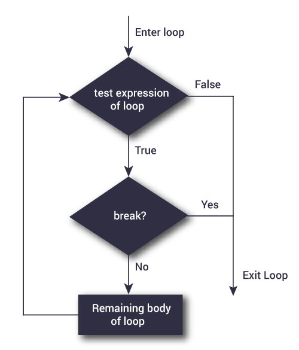
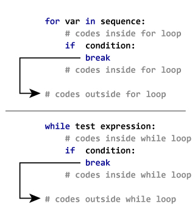
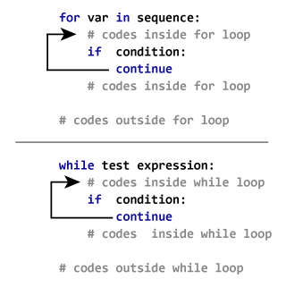

# Python `break`和`continue`

> 原文： [https://www.programiz.com/python-programming/break-continue](https://www.programiz.com/python-programming/break-continue)

#### 在本文中，您将学习使用`break`和`continue`语句来更改循环流。

## Python 中 `break`和`continue`的用途是什么？

在 Python 中，`break`和`continue`语句可以更改常规循环的流程。

循环遍历代码块，直到测试表达式为假，但有时我们希望在不检查测试表达式的情况下终止当前迭代甚至整个循环。

在这些情况下，使用`break`和`continue`语句。

* * *

## Python `break`语句

`break`语句终止包含它的循环。 程序的控制权在循环体之后立即传递到该语句。

如果`break`语句位于嵌套循环内（另一个循环内的循环），则`break`语句将终止最里面的循环。

### 中断语法

```py
break
```

### 中断流程图



Flowchart of break statement in Python


下面显示了`for`循环中和`while`循环中[`break`语句](https://www.programiz.com/python-programming/for-loop)的工作。



Working of the break statement


### 示例：Python 中断

```py
# Use of break statement inside the loop

for val in "string":
    if val == "i":
        break
    print(val)

print("The end")
```

**输出**

```py
s
t
r
The end
```

在此程序中，我们循环访问“字符串”序列。 我们检查字母是否为`i`，由此我们从循环中断开。 因此，我们在输出中看到直到`i`的所有字母都被打印。 之后，循环终止。

* * *

## Python `continue`语句

`continue`语句仅用于当前迭代，用于跳过循环内的其余代码。 循环不会终止，但会继续进行下一个迭代。

### 继续的语法

```py
continue
```

### 继续流程图


Flowchart of continue statement in Python


`for`和`while`循环中的`continue`语句的工作如下所示。



How continue statement works in python


### 示例：Python 继续

```py
# Program to show the use of continue statement inside loops

for val in "string":
    if val == "i":
        continue
    print(val)

print("The end")
```

**输出**：

```py
s
t
r
n
g
The end
```

该程序与上面的示例相同，除了`break`语句已替换为`continue`。

如果字符为`i`，我们将继续执行循环，而不执行该块的其余部分。 因此，我们在输出中看到，除了`i`以外的所有字母都已打印。