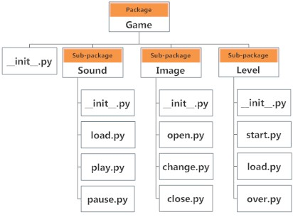

# Python 包

> 原文： [https://www.programiz.com/python-programming/package](https://www.programiz.com/python-programming/package)

#### 在本文中，您将学习使用 Python 包将代码库分为干净，高效的模块。 另外，您还将学习在 Python 程序中导入和使用自己的或第三方软件包。

## 什么是包裹？

通常，我们通常不会将所有文件存储在同一位置的计算机上。 我们使用井井有条的目录层次结构，以便于访问。

相似的文件保存在同一目录中，例如，我们可以将所有歌曲保留在“**音乐**”目录中。 与此类似，Python 具有用于目录的软件包和用于文件的[模块](/python-programming/modules)。

随着我们的应用程序中包含许多模块的程序变得越来越大，我们将相似的模块放在一个程序包中，而将不同的模块放在不同的程序包中。 这使项目（程序）易于管理且概念清晰。

同样，由于目录可以包含子目录和文件，因此 Python 程序包可以具有子程序包和模块。

目录必须包含一个名为`__init__.py`的文件，Python 才能将其视为一个包。 该文件可以保留为空，但是我们通常将该程序包的初始化代码放在此文件中。

这是一个例子。 假设我们正在开发一个游戏。 软件包和模块的一种可能组织如下图所示。



Package Module Structure in Python Programming


* * *

## 从包中导入模块

我们可以使用点（。）运算符从包中导入模块。

例如，如果在上面的示例中要导入`start`模块，则可以按以下步骤完成：

```py
import Game.Level.start
```

现在，如果此模块包含名为`select_difficulty()`的[函数](/python-programming/function)，则必须使用全名来引用它。

```py
Game.Level.start.select_difficulty(2)
```

如果这个构造看起来很冗长，我们可以如下导入不带包前缀的模块：

```py
from Game.Level import start
```

现在，我们可以简单地调用该函数，如下所示：

```py
start.select_difficulty(2)
```

从包中的模块仅导入所需函数（或类或变量）的另一种方法如下：

```py
from Game.Level.start import select_difficulty
```

现在我们可以直接调用此函数。

```py
select_difficulty(2)
```

尽管比较容易，但不建议使用此方法。 使用完整的[名称空间](/python-programming/namespace)可以避免混淆，并防止两个相同的标识符名称冲突。

导入软件包时，Python 查找`sys.path`中定义的目录列表，类似于[模块搜索路径](/python-programming/modules#search)。