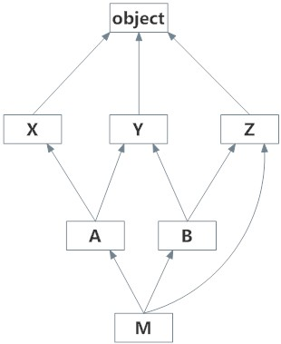

# Python 多重继承

> 原文： [https://www.programiz.com/python-programming/multiple-inheritance](https://www.programiz.com/python-programming/multiple-inheritance)

#### 在本教程中，您将学习 Python 中的多重继承以及如何在程序中使用它。 您还将了解多级继承和方法解析顺序。

## Python 多重继承

[类](/python-programming/class)可以从 Python 中的多个基类派生，类似于 C ++。 这称为多重继承。

在多重继承中，所有基类的功能都继承到派生类中。 多重继承的语法类似于单一[继承](/python-programming/inheritance)。

### 例

```py
class Base1:
    pass

class Base2:
    pass

class MultiDerived(Base1, Base2):
    pass
```

在此，`多派生的`类是从 `Base1` 和 `Base2` 类派生的。

<figure>

<figcaption>Multiple Inheritance in Python</figcaption>

</figure>

`MultiDerived` 类继承自 `Base1` 和 `Base2` 类。

* * *

## Python 多层次继承

我们还可以从派生类继承。 这称为多级继承。 在 Python 中可以是任何深度。

在多级继承中，基类和派生类的功能都被继承到新的派生类中。

下面给出了具有相应可视化效果的示例。

```py
class Base:
    pass

class Derived1(Base):
    pass

class Derived2(Derived1):
    pass
```

这里， `Derived1` 类是从 `Base` 类派生的， `Derived2` 类是从 `Derived1` 类派生的。

<figure>

<figcaption>Multilevel Inheritance in Python</figcaption>

</figure>

* * *

## Python 中的方法解析顺序

Python 中的每个类均源自`object`类。 它是 Python 中最基本的类型。

因此，从技术上讲，所有其他内置或用户定义的类都是派生类，并且所有对象都是`object`类的实例。

```py
# Output: True
print(issubclass(list,object))

# Output: True
print(isinstance(5.5,object))

# Output: True
print(isinstance("Hello",object))
```

在多继承方案中，将在当前类中首先搜索任何指定的属性。 如果未找到，则搜索将以深度优先，从左到右的方式继续进入父类，而无需两次搜索相同的类。

因此，在上述`MultiDerived`类的示例中，搜索顺序为[`MultiDerived`，`Base1`，`Base2`，`object`]。 该顺序也称为`MultiDerived`类的线性化，用于查找该顺序的规则集称为**方法解析顺序（MRO）**。

MRO 必须防止本地优先级排序，并且还必须提供单调性。 它确保班级始终出现在其班级之前。 如果有多个父母，顺序与基类的元组相同。

类别的 MRO 可以视为`__mro__`属性或`mro()`方法。 前者返回一个元组，而后者返回一个列表。

```py
>>> MultiDerived.__mro__
(<class '__main__.MultiDerived'>,
 <class '__main__.Base1'>,
 <class '__main__.Base2'>,
 <class 'object'>)

>>> MultiDerived.mro()
[<class '__main__.MultiDerived'>,
 <class '__main__.Base1'>,
 <class '__main__.Base2'>,
 <class 'object'>]
```

这是一个稍微复杂的多重继承示例及其可视化以及 MRO。

<figure>

<figcaption>Visualizing Multiple Inheritance in Python</figcaption>

</figure>

```py
# Demonstration of MRO

class X:
    pass

class Y:
    pass

class Z:
    pass

class A(X, Y):
    pass

class B(Y, Z):
    pass

class M(B, A, Z):
    pass

# Output:
# [<class '__main__.M'>, <class '__main__.B'>,
#  <class '__main__.A'>, <class '__main__.X'>,
#  <class '__main__.Y'>, <class '__main__.Z'>,
#  <class 'object'>]

print(M.mro())
```

**输出**

```py
[<class '__main__.M'>, <class '__main__.B'>, <class '__main__.A'>, <class '__main__.X'>, <class '__main__.Y'>, <class '__main__.Z'>, <class 'object'>]
```

要了解有关如何计算 MRO 的实际算法，请访问[关于 MRO 的讨论](http://www.python.org/download/releases/2.3/mro/)。