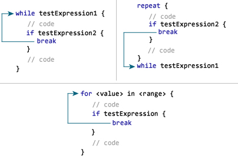
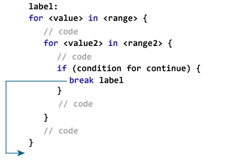

# 速决声明

> 原文： [https://www.programiz.com/swift-programming/break-statement](https://www.programiz.com/swift-programming/break-statement)

#### 在本文中，您将学习使用 break 语句来转移程序的控制权。

使用循环或条件语句时，可能需要跳过循环中的某些语句或立即终止循环，而不检查测试表达式

在这种情况下，将使用 break 和 Continue 语句。 在下一章中，您将了解[继续语句](/swift-programming/continue-statement "Swift continue statement")。

break 语句停止执行循环或 switch 语句。 然后，它跳转到 loop 或 switch 语句之后的下一个语句。

break 语句的语法为：

```swift
break
```

* * *

## break 语句如何工作？



* * *

## 示例 1：for 循环中的 Swift break 语句

```swift
for i in 1...5 {
    if i == 4 {
        break
    }
    print("i = \(i)")
}
print("The end") 
```

运行该程序时，输出为：

```swift
i = 1
i = 2
i = 3
The end 
```

在上面的程序中，要迭代的序列的范围是 1 到 5。

`i`的值设置为范围（1）中的第一个数字，并在每次迭代时更新为范围的下一个数字。

该循环还包含带有表达式`i == 4`的 if 语句。 当表达式为真（第 4 次迭代）时，将执行`break`语句，并且 [for-in 循环](/swift-programming/for-in-loop)终止。

然后，它跳出循环以打印**末尾**。

* * *

## 示例 2：while 循环中的 Swift break 语句

```swift
var currentLevel:Int = 1, finalLevel:Int = 2
var isLifeAvailable = true
while (isLifeAvailable) {

    if currentLevel > finalLevel {
        print("Game Completed. No level remaining")
        break
    }
    //play game and go to next level
    currentLevel += 1
    print("next level")
}
print("outside of while loop") 
```

运行该程序时，输出为：

```swift
next level
next level
Game Completed. No level remaining
outside of while loop 
```

在上面的程序中，while 循环的测试表达式始终为`true`。

当`currentLevel`大于`finalLevel`时，将执行 if 块内的`break`语句。 然后，程序退出（终止）while 循环，并在循环之后执行语句，即`print("outside of while loop")` ..

* * *

## 示例 3：带嵌套循环的 Swift break 语句

```swift
for j in 1...2 {
    for i in 1...5 {
        if i == 4 {
            break
        }
        print("i = \(i)")
    }
    print("j = \(j)")
} 
```

When you run the program,the output will be:

```swift
i = 1
i = 2
i = 3
j = 1
i = 1
i = 2
i = 3
j = 2 
```

在以上程序中，`if i == 4`中的`break`语句仅终止内部循环`for i in 1...5`的执行。 但是，它继续执行外循环`for j in 1...2`。

但是，如果您也想`break`外环`for j in 1...2`，该怎么办。 为此，我们在 Swift 中使用带标签的语句。

* * *

## 带中断的标记语句

前缀为（label：Statement）形式的语句称为带标签的语句。 标签是一个标识符，您可以稍后在 break 或 continue 语句中引用它。 要了解有关标记语句的更多信息，请访问 *Swift 标记语句*。

### 带中断的标记语句如何工作？



在此，`label`是标识符。 执行`break`语句时，它将终止`label`内部的循环，程序将立即跳转到该标签后的语句。

### 例 4：带有 break 的标记语句

```swift
outerloop: for j in 1...2{
    innerloop: for i in 1...5 {
        if i == 4 {
            break outerloop
        }
        print("i = \(i)")
    }
    print("j = \(j)")
} 
```

When you run the program, the output will be:

```swift
i = 1
i = 2
i = 3 
```

在上面的程序中，有两个标记的语句`outerloop: for j in 1...2`和`innerloop: for i in 1...5`。

标签名称`externalloop`和`innerloop`可以与`break`语句一起使用。

语句`break outerloop`终止两个循环并结束程序。

如果您熟悉其他编程语言，例如 C，C ++，Java 等，则`break`语句用于终止 switch 语句。 但是在 Wwift 中，switch 语句在第一个匹配的 switch 用例完成后立即完成其执行。 因此，在 Swift 的 switch 案例中添加 break 是可选的。 要了解更多信息，请访问 [Swift switch 语句](/swift-programming/switch-statement "Swift switch statement")。