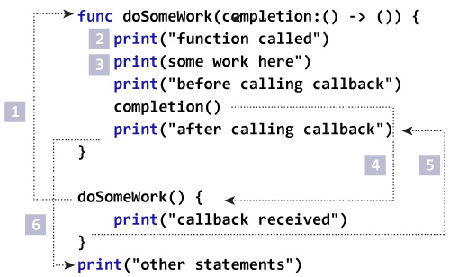

# 迅速关闭

> 原文： [https://www.programiz.com/swift-programming/closures](https://www.programiz.com/swift-programming/closures)

#### 在本文中，您将通过示例学习什么是闭包，语法，Swift 中的闭包类型。

在文章 [Swift 函数](/swift-programming/functions "Swift functions")中，我们使用`func`关键字创建了一个函数。 但是，Swift 中还有另一种特殊类型的函数，称为**闭包**，可以在不使用关键字`func`和函数名的情况下进行定义。

像函数一样，闭包可以接受参数并返回值。 它还包含一组语句，这些语句在调用后执行，并且可以作为函数分配给变量/常量。

闭包主要用于两个原因：

1.  **完成块**
    闭包可帮助您在某些任务完成执行时得到通知。 请参阅[关闭作为完成处理程序](#completion)，以了解有关它的更多信息。
2.  **高阶函数**
    闭包可以作为高阶函数的输入参数传递。 高阶函数只是一种接受函数作为输入并返回类型函数的值作为输出的函数类型。
    为此，最好使用闭包代替函数，因为闭包省略了 func 关键字和函数名，从而使代码更具可读性和简短性。

* * *

## 闭合语法

闭包表达式语法具有以下一般形式：

```swift
{ (parameters) -> return type in
   statements
}

```

请注意，在返回类型之后使用`in`关键字。`in`关键字用于在闭包内部分隔返回类型和语句。 闭包接受参数并可以返回值。 让我们通过以下示例学习创建自己的闭包：

* * *

### 示例 1：简单关闭

```swift
let simpleClosure = {   
}
simpleClosure() 
```

在以上语法中，我们声明了一个简单的闭包`{ }`，该闭包不包含任何参数，不包含任何语句且不返回任何值。 该闭包分配给常量`simpleClosure`。

我们将闭包称为`simpleClosure()`，但是由于它不包含任何语句，因此该程序不执行任何操作。

* * *

### 示例 2：包含语句的闭包

```swift
let simpleClosure = {
    print("Hello, World!")
}
simpleClosure() 
```

当您运行上述程序时，输出将是：

```swift
Hello, World!
```

在上面的程序中，您已经定义了一个闭包`simpleClosure`。`simpleClosure`的类型被推断为`() -> ()`，因为它不接受参数并且不返回值。

如果要显式定义闭包的类型，则可以使用`let simpleClosure:() -> ()`进行定义。

与第一个示例不同，以`simpleClosure()`调用闭包将在其中执行`print()`语句。 这会在控制台中打印`Hello, World!`。

* * *

### 示例 3：接受参数的闭包

```swift
let simpleClosure:(String) -> () = { name in
    print(name)
}
simpleClosure("Hello, World") 
```

When you run the above program, the output will be:

```swift
Hello, World!
```

在上述程序中，闭包的类型`(String) -> ()`声明闭包接受的类型为`String`，但不返回值。您可以通过在闭包的语句中放置参数`name`，后跟`in`关键字来使用传递的值。

请记住，`in`关键字的使用是将参数名称与语句分开。 由于闭包接受`String`，因此在将闭包称为`simpleClosure("Hello, World")`时需要传递字符串。 这将在闭包内部执行语句并输出**世界，您好！ 控制台中的**。

* * *

### 示例 4：返回值的闭包

闭包也可以作为函数返回值。 如果需要从闭包中返回值，则必须显式添加类型以返回括号内的`()`，然后是`->`。

```swift
let simpleClosure:(String) -> (String) = { name in

    let greeting = "Hello, World! " + "Program"
    return greeting
}

let result = simpleClosure("Hello, World")
print(result) 
```

When you run the above program, the output will be:

```swift
Hello, World! Program
```

在上面的程序中，我们将类型定义为`simpleClosure: (String) -> (String)`，因为 Swift 无法自动推断出返回值的闭包。 类型`(String) -> (String)`声明闭包采用类型`String`的输入，并返回类型`String`的值。

正如我们在 *Swift 函数*中了解到的那样，闭包还使用 return 关键字`return greeting`返回一个值，并且返回值可以在变量/常量中分配为`let result =`。

* * *

### 示例 4：将闭包作为函数参数传递

我们还可以将闭包作为参数传递给函数，如下所示：

```swift
func someSimpleFunction(someClosure:()->()) {

    print("Function Called")
}

someSimpleFunction(someClosure: {
    print("Hello World! from closure")
}) 
```

When you run the above program, the output will be:

```swift
Function Called
```

在上述程序中，该函数接受类型为`()->()`的闭包，即不接受任何输入且不返回任何值。

现在，当调用函数`someSimpleFunction()`时，您可以将闭包`{ print("Hello World! from closure") }`作为参数传递。

函数调用触发函数内部的`print("Function Called")`语句，该语句在屏幕上输出**被调用的**函数。 但是，由于尚未调用闭包，因此不会执行闭包语句。

您可以简单地以`someClosure()`的形式调用闭包，它在闭包内执行语句。

```swift
func someSimpleFunction(someClosure:()->()) {
    print("Function Called")
    someClosure()
}

someSimpleFunction(someClosure:  {

    print("Hello World! from closure")

}) 
```

When you run the above program, the output will be:

```swift
Function Called
Hello World! from closure
```

* * *

## 尾随闭包

如果函数接受闭包作为最后一个参数，则可以类似于`{ }`之间的函数主体传递闭包。 这种写在函数调用括号之外的闭包类型称为尾随闭包。

可以使用结尾闭包将上述程序重写为：

### 示例 5：尾随闭包

```swift
func someSimpleFunction(msg:String, someClosure:()->()) {
    print(msg)
    someClosure()
}

someSimpleFunction(msg:"Hello Swift Community!")  {
    print("Hello World! from closure")
} 
```

When you run the above program, the output will be:

```swift
Hello Swift Community!
Hello World! from closure
```

在上述程序中，函数`someSimpleFunction()`接受闭包作为最终参数。 因此，在调用函数时，没有使用闭包作为参数，而是使用了尾随闭包。

如您所见，在函数调用中

```swift
someSimpleFunction(msg:"Hello Swift Community!")  {
    print("Hello World! from closure")
}

```

闭包`{ print("Hello World! from closure") }`看起来像函数的主体，而不是函数的参数，但请记住，它仍然是函数的参数。

由于尾随闭包，我们没有为闭包指定参数名称，这会使代码更短，更易读。

写尾随闭包不是强制性的。 但是，出于可读性考虑，建议当函数接受闭包作为最终参数时。

* * *

## 自动关闭

用`@autoclosure`关键字标记的闭包称为自动闭包。`@autoclosure`关键字通过添加`{}`在表达式周围创建自动闭包。 因此，在将闭包传递给函数时，可以省略花括号`{}`。

使用自动关闭的主要优点是，调用关闭时，无需将表达式用大括号`{}`括起来。

让我们在示例中看一下。

### 示例 6：不使用@autoclosure 进行关闭

```swift
func someSimpleFunction(someClosure:()->(), msg:String) {
    print(msg)
    someClosure()
}

someSimpleFunction(someClosure: ({

    print("Hello World! from closure")

}), msg:"Hello Swift Community!") 
```

When you run the above program, the output will be:

```swift
Hello Swift Community!
Hello World! from closure
```

在上面的程序中，我们声明了一个函数，该函数接受常规闭包`()->()`作为函数`someSimpleFunction()`的参数。 您可以看到，调用函数时，需要在函数参数周围添加`{}`，如下所示：

```swift
someClosure: ({
    print("Hello World! from closure")
})

```

我们可以使用自动关闭功能将上述程序重写为：

* * *

### 示例 7：自动关闭

```swift
func someSimpleFunction(someClosure: @autoclosure ()->(), msg:String) {
    print(msg)
    someClosure()
}

someSimpleFunction(someClosure: (print("Hello World! from closure")), msg:"Hello Swift Community!") 
```

When you run the above program, the output will be:

```swift
Hello Swift Community!
Hello World! from closure 
```

在上面的程序中，我们已将闭包`()->()`标记为具有`@autoclosure`属性的自动闭包类型。 因此，您不必在函数参数周围将`{ }`添加为`someClosure: (print("Hello World! from closure"))`。

* * *

## 具有参数和返回值的自动闭合

像普通的闭包一样，您可以将参数传递给自动闭包并从中返回值。 但是，即使您传递参数，它们也会被忽略并且不能在闭包内部使用。 这是因为您无法定义参数以将其用作`{ arg in }`。

因此，建议创建不带参数但可以返回值的自动关闭。 值是包装在其中的表达式。 让我们在下面的示例中看到这一点。

### 示例 8：具有返回值的自动闭合

```swift
func someSimpleFunction(_ someClosure:@autoclosure ()->(String)) {
    let res = someClosure()
    print(res)
}
someSimpleFunction("Good Morning") 
```

When you run the above program, the output will be:

```swift
Good Morning
```

在上面的程序中，我们定义了一个不带参数但返回`String`（`()->(String)`）的函数。 我们将自动关闭功能**“早上好”** 传递给了该功能。 这也是闭包的返回值。

因此，当我们在函数内部调用`someClosure()`时，它返回了**早安**值。

### 示例 9：带参数的自动闭合

```swift
func someSimpleFunction(_ someClosure:@autoclosure (String)->(String)) {
    let res = someClosure("Hello World")
    print(res)
}
someSimpleFunction("Good Morning") 
```

When you run the above program, the output will be:

```swift
Good Morning
```

在上面的程序中，我们定义了一个需要自动关闭的函数。 闭包采用`String`类型的值，并且还返回`String`类型的值。

像前面的示例一样，我们将自动闭包**“ Good Morning”** 传递给函数，这是闭包的返回值。

因此，即使自动关闭称为`someClosure("Hello World")`，它也不能接受任何参数，它仍会返回并打印**早安**。

* * *

## 转义与无转义闭包

### 无逃逸关闭

当闭包作为参数传递给函数时，闭包被认为是无法逃脱的，并在函数返回之前被调用。 闭包不在函数外部使用。

在 Swift 中，默认情况下所有闭包参数都不会转义。 转义和不转义闭包的概念是用于编译器优化的。

#### 示例 10：没有转义的闭包

```swift
func testFunctionWithNoEscapingClosure(myClosure:() -> Void) {
    print("function called")
    myClosure()
    return
}

//function call
testFunctionWithNoEscapingClosure {
    print("closure called")
} 
```

When you run the above program, the output will be:

```swift
function called
closure called 
```

在上面的示例中，闭包被称为没有转义，因为闭包`myClosure()`在函数返回之前被调用，并且闭包不在函数主体之外使用。

* * *

### 逃逸关闭

当闭包作为函数的参数传递给闭包时，闭包被认为是对函数的转义，但是在函数返回或在函数主体之外使用闭包后调用闭包。

#### 示例 11：转义闭包

```swift
var closureArr:[()->()] = []
func testFunctionWithEscapingClosure(myClosure:@escaping () -> Void) {
    print("function called")

    closureArr.append(myClosure)
    myClosure()

    return
}

testFunctionWithEscapingClosure {
     print("closure called")
} 
```

When you run the above program, the output will be:

```swift
function called
closure called 
```

在上面的示例中，我们声明了一个变量`ClosureArr`，它可以存储类型为`()->()`的闭包数组。

现在，如果将在函数范围内定义的闭包`myClosure`附加到在函数外部定义的`ClosureArr`，则闭包`myClosure`需要逸出主体 功能的

因此，闭包需要转义并标记为`@escaping`关键字。

#### 示例 12：没有转义的闭包

在上面的“不转义闭包”部分中，我们描述了如果在函数返回之前调用了闭包，则闭包需要不转义。 因此，如果在函数返回后调用闭包，则应该转义，对吗？

让我们用一个例子测试一下：

```swift
func testFunctionWithNoEscapingClosure(myClosure:() -> Void) {
    return
    myClosure()
} 
```

上面的代码返回警告，因为出现在 return 语句之后的语句（在我们的示例中为`myClosure()`）没有执行，因为 return 语句将程序的控制权转移给了函数调用者。

因此，我们如何测试，以便在函数返回后调用闭包。 如果将闭包调用放在异步操作中，则可以完成此操作。

同步操作在移至下一条语句（从上到下的顺序）之前等待操作完成/完成。 并且，即使当前操作尚未完成，异步也会移至下一条语句。

因此，放置在异步操作内的语句可能稍后会在某些时候执行。

```swift
func testFunctionWithNoEscapingClosure(myClosure:@escaping () -> Void) {
    DispatchQueue.main.async {
        myClosure()
    }
    return
} 
```

在上述程序中，`DispatchQueue.main.async`异步运行代码块。 所以，现在。 即使在函数返回后也可能发生闭包调用`myClosure()`。 因此，闭包需要转义，并用`@escaping`关键字标记。

* * *

## 关闭为完成处理程序

完成处理程序是回调/通知，可让您在函数完成其任务时执行某些操作。

完成处理程序主要用于异步操作中，以便调用者可以知道操作何时完成，以便在操作完成后执行某些操作。

### 示例 13：作为完成处理程序的闭包

```swift
func doSomeWork(completion:()->()) {
    print("function called")
    print("some work here")
    print("before calling callback")
    completion()
    print("after calling callback")
}

doSomeWork(completion: {
    print("call back received")
})

print("Other statements") 
```

When you run the above program, the output will be:

```swift
function called
some work here
before calling callback
call back received
after calling callback
Other statements 
```

上面的程序也可以使用结尾闭包重写为：

### 示例 14：尾随闭包作为完成处理程序

```swift
func doSomeWork(completion:()->()) {
    print("function called")
    print("some work here")
    print("before calling callback")
    completion()
    print("after calling callback")
}

doSomeWork() {
    print("call back received")
}

print("Other statements") 
```

* * *

### 完成处理程序如何工作？



执行步骤如下：

1.  `doSomeWork()`调用在函数内部执行语句的函数
2.  `print("function called")`在控制台中输出称为的**功能。**
3.  您可以在函数内部执行一些工作。 目前，仅`print("some work here")`语句在控制台中的输出为**。**
4.  对闭包的简单调用为`completion()`，它将发送回调并将程序的控制权转移到闭包内的语句。
    因此，执行`print("call back received")`，在控制台中输出接收到的**回调**。
5.  之后，程序控制再次返回到关闭调用，并执行语句`print("after calling callback")`，该语句在控制台中调用回调后输出**。**
6.  函数内部的语句执行后，程序将控制权转移到函数调用`doSomeWork()`，然后执行下一个语句`print("Other statements")`，该语句在控制台中输出**其他语句**。

让我们来看一个更实际的示例，将闭包用作完成处理程序。

* * *

### 示例 11：作为完成处理程序的闭包

```swift
var closeButtonPressed = false
func codeinPlayground(completion:(String)->()) {

    print("Code, Take a Nap and Relax")
    if closeButtonPressed {
        completion("Close the playground")
    }
}

codeinPlayground { (msg) in
    print(msg)
} 
```

When you run the above program, the output will be:

```swift
Code, Take a Nap and Relax
在上面的程序中，我们声明了一个变量`closeButtonPressed`，该变量将模拟用户是否在操场上轻按了关闭按钮。 想想如果您按下关闭按钮，变量`closeButtonPressed`将是`true`。

函数`codeinPlayground`接受闭包作为参数。 闭包`completion`接受`String`，但不返回值。 由于`closeButtonPressed`被分配了`false`，因此 if 语句内的语句未执行且没有调用闭包。

现在，如果将`closeButtonPressed`分配给`true`（即，当用户按下关闭按钮时）作为`var closeButtonPressed = true`，则会调用 if 执行和关闭语句。

当为变量`closeButtonPressed`分配 true 时，输出为：

```
Code, Take a Nap and Relax
Close the playground 
```swift

在这里，我们将闭包用作完成处理程序，因为当用户点击关闭按钮时，我们不想在函数`codeinPlayground`中执行语句，而是通过调用闭包`completion("Close the playground")`来完成其执行。

这样，我们就有机会处理与闭包语句内的函数相关的所有最终事件。 在本例中，我们在控制台中将消息输出为`print(msg)`。

```